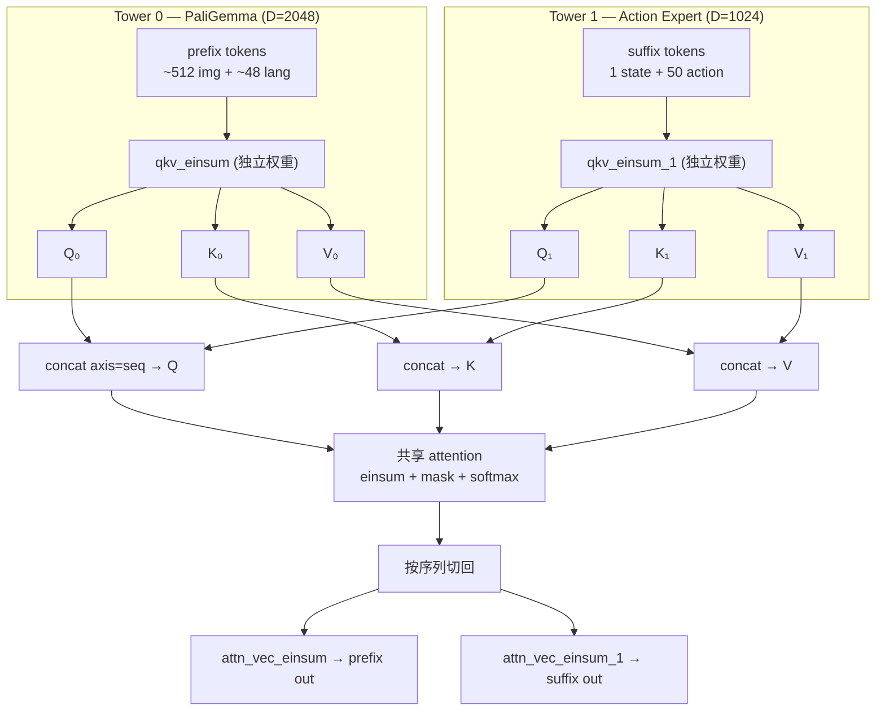
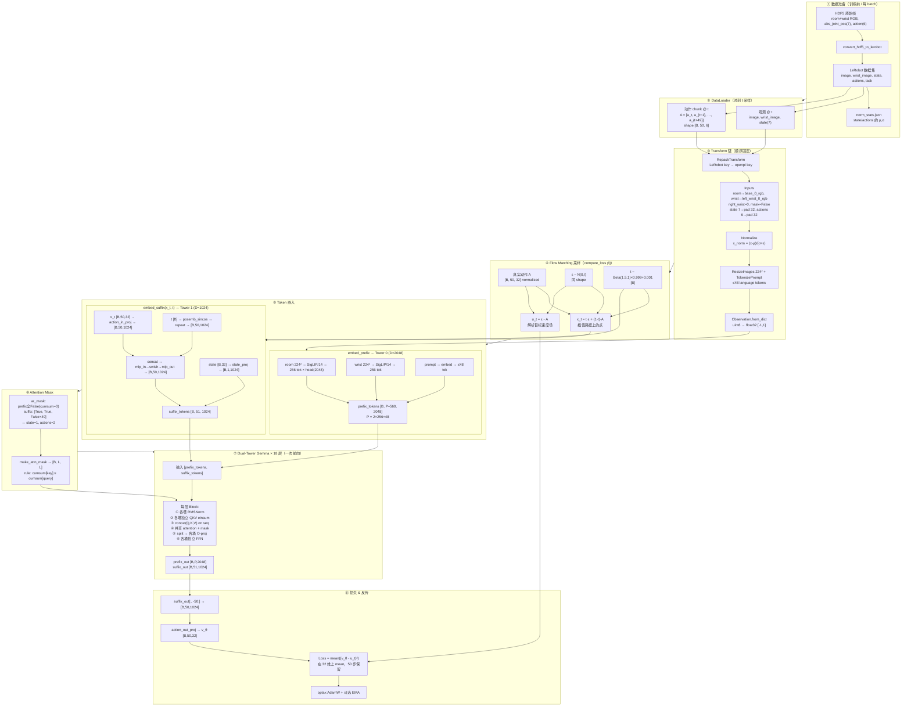
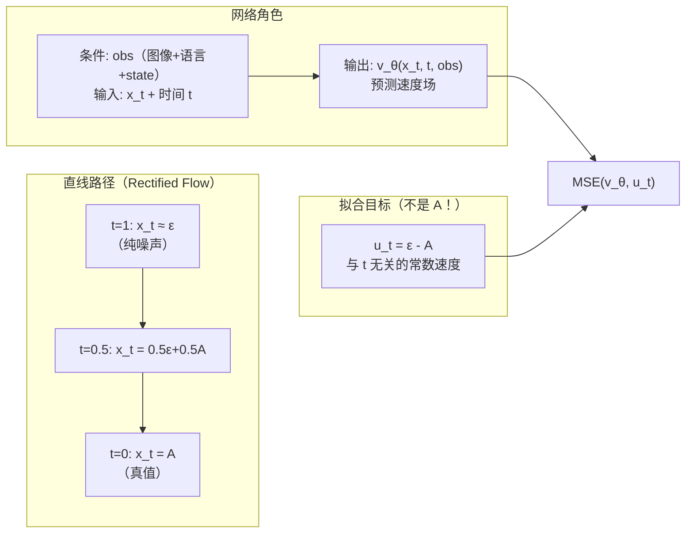
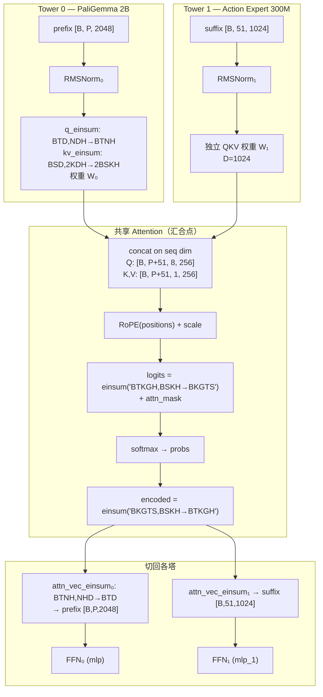
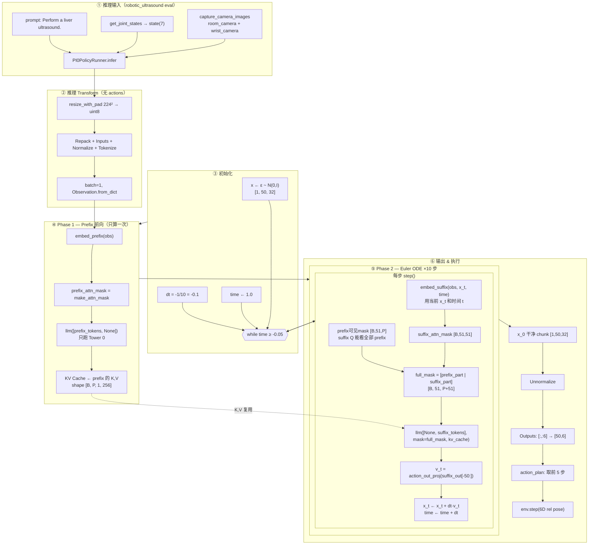
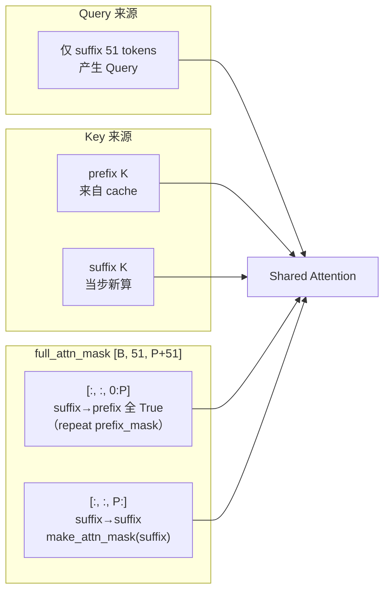

# Gemma dual-tower attention sharing
_Exported on 2026/6/29 at GMT+8 15:50:45 from Cursor (3.8.11)_

---

**User**

@cursor_robotic_ultrasound_training_and.md 

这个是在另外一台机器上面的对话，我保存了下来，我想继续往下挖，单独画 Gemma dual-tower 里 prefix/suffix 怎么共享 attention（gemma.py 里的 einsum），把 50 个 action token 的 causal mask 用示意图展开。

---

**Cursor**

我先读你保存的对话记录，并在代码里定位 `gemma.py` 中 dual-tower prefix/suffix 的 attention 与 einsum 实现。


下面专门展开 **Gemma dual-tower 共享 attention**（`gemma.py` 里的 einsum）和 **51 个 suffix token（1 state + 50 action）的 mask 结构**。上一段对话里「action 内部 causal」的说法不够准确——实际是 **block attention**，50 个 action token 彼此是 **全互看** 的。

---

## 1. Dual-tower 是什么：两套权重，一次 attention

PI0 把两个 Gemma 叠在同一个 `Module` 里：

```150:155:third_party/openpi/src/openpi/models/pi0.py
        llm = nnx_bridge.ToNNX(
            _gemma.Module(
                configs=[paligemma_config, action_expert_config],
                embed_dtype=config.dtype,
            )
        )
```

| 塔 | variant | `width` | 处理的 token |
|----|---------|---------|-------------|
| Tower 0 | `gemma_2b` | **2048** | prefix：SigLIP 图像 + 语言 |
| Tower 1 | `gemma_300m` | **1024** | suffix：state + 50 action |

**共享的是 attention 几何，不是权重：**

```157:160:third_party/openpi/src/openpi/models/gemma.py
        # all experts must share the same head dim, num heads, and num kv heads for self-attention to work
        assert all(config.head_dim == self.configs[0].head_dim for config in self.configs)
        assert all(config.num_heads == self.configs[0].num_heads for config in self.configs)
        assert all(config.num_kv_heads == self.configs[0].num_kv_heads for config in self.configs)
```

两塔都是 `num_heads=8`, `num_kv_heads=1`, `head_dim=256`，所以 Q/K/V 可以在序列维 concat 后做 **同一次** softmax attention。

---

## 2. 数据流总览



要点：**Q/K/V 各自用本塔权重算，attention 在拼接后的全长序列上算，输出再切回各塔做 `o_proj`。**

---

## 3. `gemma.py` 里 einsum 逐步拆解

轴命名（文件头注释）：

```
B: batch    T: query len    S: key len
N/K: heads  G: GQA groups  H: head_dim    D: width
```

### Step 1 — 各塔独立算 Q/K/V

GQA（`num_kv_heads=1 < num_heads=8`）时走 split 路径：

```177:191:third_party/openpi/src/openpi/models/gemma.py
                q_einsum = lora.Einsum(
                    shape=(config.num_heads, config.width, config.head_dim),
                    ...
                )
                q = q_einsum("BTD,NDH->BTNH", x)
                kv_einsum = lora.Einsum(
                    shape=(2, config.num_kv_heads, config.width, config.head_dim),
                    ...
                )
                k, v = kv_einsum("BSD,2KDH->2BSKH", x)
```

| einsum | 输入 `x` | 权重 | 输出 |
|--------|----------|------|------|
| `BTD,NDH->BTNH` | `(B,T,D)` | `(N=8, D, H=256)` | Q: `(B,T,8,256)` |
| `BSD,2KDH->2BSKH` | `(B,S,D)` | `(2, K=1, D, H)` | K,V: 各 `(B,S,1,256)` |

Tower 0 的 `D=2048`，Tower 1 的 `D=1024`，**权重矩阵不同**，输出 head 形状相同。

### Step 2 — 沿序列维拼接

```193:193:third_party/openpi/src/openpi/models/gemma.py
        q, k, v = (jnp.concatenate(y, axis=1) for y in zip(*qkvs, strict=True))
```

设 prefix 长 `P`，suffix 长 `S=51`：

```
Q: (B, P+51, 8, 256)
K: (B, P+51, 1, 256)   ← 1 个 KV head
V: (B, P+51, 1, 256)
```

### Step 3 — RoPE + scale

```195:198:third_party/openpi/src/openpi/models/gemma.py
        q = _apply_rope(q, positions=positions)
        q *= self.configs[0].head_dim ** -0.5
        k = _apply_rope(k, positions=positions)
```

`positions` 来自 `jnp.cumsum(input_mask, axis=1) - 1`，prefix 和 suffix 共用一条位置序列。

### Step 4 — 核心 attention einsum（共享）

```208:209:third_party/openpi/src/openpi/models/gemma.py
        q = einops.rearrange(q, "B T (K G) H -> B T K G H", K=self.configs[0].num_kv_heads)
        logits = jnp.einsum("BTKGH,BSKH->BKGTS", q, k, preferred_element_type=jnp.float32)
```

GQA 展开：`8 heads / 1 kv_head → G=8`

```
q: (B, T, K=1, G=8, H=256)
k: (B, S, K=1, H=256)

logits[b,k,g,t,s] = Σ_h q[b,t,k,g,h] · k[b,s,k,h]
→ (B, K=1, G=8, T, S)  即每个 query 对每个 key 的打分
```

**物理含义**：Tower 0 的 image token 和 Tower 1 的 action token 的 Q，共同 attend 到 **拼接后的全长 K**（含两塔所有 token 的 K）。

### Step 5 — Mask + Softmax

```218:220:third_party/openpi/src/openpi/models/gemma.py
        masked_logits = jnp.where(attn_mask[:, :, None, :, :], logits, big_neg)
        probs = jax.nn.softmax(masked_logits, axis=-1).astype(dtype)
```

`mask` 在 `Module.__call__` 里被扩成 `(B, 1, T, S)`，与 logits 广播。

### Step 6 — 加权求和 V

```222:223:third_party/openpi/src/openpi/models/gemma.py
        encoded = jnp.einsum("BKGTS,BSKH->BTKGH", probs, v)
        encoded = einops.rearrange(encoded, "B T K G H -> B T (K G) H")
```

```
encoded[b,t,k,g,h] = Σ_s probs[b,k,g,t,s] · v[b,s,k,h]
→ (B, T, 8, 256)
```

### Step 7 — 切回各塔，独立 output proj

```225:239:third_party/openpi/src/openpi/models/gemma.py
        out = []
        start = 0
        for i, (x, config) in enumerate(zip(xs, self.configs, strict=True)):
            if x is not None:
                end = start + x.shape[1]
                out_einsum = lora.Einsum(
                    shape=(config.num_heads, config.head_dim, config.width),
                    ...
                )
                out.append(out_einsum("BTNH,NHD->BTD", encoded[:, start:end]))
                start = end
```

| 塔 | o_proj einsum | `D` |
|----|---------------|-----|
| Tower 0 | `BTNH,NHD->BTD` | 2048 |
| Tower 1 | `BTNH,NHD->BTD` | 1024 |

**FFN 不共享**：每塔有独立的 `mlp` / `mlp_1`，只在 attention 层「碰面」。

---

## 4. 推理时的 KV cache

```203:206:third_party/openpi/src/openpi/models/gemma.py
        if kv_cache is not None:
            cache_k, cache_v = kv_cache
            k = jnp.concatenate([cache_k, k], axis=1)
            v = jnp.concatenate([cache_v, v], axis=1)
```

```287:312:third_party/openpi/src/openpi/models/pi0.py
        _, kv_cache = self.PaliGemma.llm([prefix_tokens, None], mask=prefix_attn_mask, positions=positions)
        ...
            (prefix_out, suffix_out), _ = self.PaliGemma.llm(
                [None, suffix_tokens], mask=full_attn_mask, positions=positions, kv_cache=kv_cache
            )
```

| 阶段 | 输入 | 算什么 |
|------|------|--------|
| 第 1 次前向 | `[prefix, None]` | 只跑 Tower 0，缓存 prefix 的 K/V |
| 每步 ODE | `[None, suffix]` | Tower 1 算 suffix Q/K/V，与 cache concat，suffix Q attend 全长 K/V |

10 步 Euler 只重复 suffix 前向；prefix K/V **只算一次**。

---

## 5. Attention mask 机制：`make_attn_mask`

```20:45:third_party/openpi/src/openpi/models/pi0.py
def make_attn_mask(input_mask, mask_ar):
    mask_ar = jnp.broadcast_to(mask_ar, input_mask.shape)
    cumsum = jnp.cumsum(mask_ar, axis=1)
    attn_mask = cumsum[:, None, :] <= cumsum[:, :, None]
    valid_mask = input_mask[:, None, :] * input_mask[:, :, None]
    return jnp.logical_and(attn_mask, valid_mask)
```

规则：**query `i` 能看 key `j`，当且仅当 `cumsum[j] ≤ cumsum[i]`**（且双方非 padding）。

`mask_ar=True` 表示「从这里开始新的 attention block」（不是普通 causal 的「只能看左边」）。

### 5.1 `ar_mask` 怎么设

**Prefix**（`embed_prefix`）：

```193:202:third_party/openpi/src/openpi/models/pi0.py
            ar_mask += [False] * image_tokens.shape[1]   # 每个图像 token
            ...
            ar_mask += [False] * tokenized_inputs.shape[1]  # 语言 token
```

全部 `False` → `cumsum = 0` → prefix 内部 **双向全连接**。

**Suffix**（`embed_suffix`）：

```219:234:third_party/openpi/src/openpi/models/pi0.py
        ar_mask += [True]          # state：新 block
        ...
        ar_mask += [True] + ([False] * (self.action_horizon - 1))  # action[0]=True, action[1..49]=False
```

拼接后整条序列的 `cumsum` 示意（`P` = prefix 长度）：

```
位置:     [  prefix (P个)  | S | A0 | A1 | A2 | ... | A49 ]
ar_mask:  [  0,0,...,0    | 1 | 1  | 0  | 0  | ... |  0  ]
cumsum:   [  0,0,...,0    | 1 | 2  | 2  | 2  | ... |  2  ]
```

### 5.2 谁能看谁（完整规则）

| Query 所在 block | cumsum | 能 attend 的 key（cumsum ≤ 自己的） |
|------------------|--------|-------------------------------------|
| Prefix | 0 | 仅 Prefix（0） |
| State | 1 | Prefix（0）+ State（1） |
| Action 0..49 | 2 | Prefix（0）+ State（1）+ 全部 Action（2） |

推论：

1. **Prefix 看不到 suffix**（防信息泄漏：图像/语言不能「偷看」noisy action）
2. **State 看不到 action**（state 是独立条件 token）
3. **50 个 action 彼此全互看**（不是 step-wise causal！）
4. **所有 suffix 都能看完整 prefix**

---

## 6. Suffix 局部 mask 示意图（1 state + 50 action）

`✓` = 可 attend，`✗` = 不可。行 = Query，列 = Key。

### 6.1 仅 suffix 内部（51×51）

```
         S   A0  A1  A2  ... A49
      ┌───┬───┬───┬───┬─────┐
   S  │ ✓ │ ✗ │ ✗ │ ✗ │ ✗✗✗ │  state 只看自己
      ├───┼───┼───┼───┼─────┤
  A0  │ ✓ │ ✓ │ ✓ │ ✓ │ ✓✓✓ │
  A1  │ ✓ │ ✓ │ ✓ │ ✓ │ ✓✓✓ │  50 个 action
  A2  │ ✓ │ ✓ │ ✓ │ ✓ │ ✓✓✓ │  彼此全连接
  ... │ ✓ │ ✓ │ ✓ │ ✓ │ ✓✓✓ │  (双向)
 A49  │ ✓ │ ✓ │ ✓ │ ✓ │ ✓✓✓ │
      └───┴───┴───┴───┴─────┘
```

### 6.2 跨 prefix / suffix（概念图）

```
                    Keys →
                 [ Prefix | S | Actions(50) ]
              ┌──────────┬───┬─────────────┐
    Prefix Q  │  ✓✓✓✓✓  │ ✗ │   ✗✗✗✗✗   │
              ├──────────┼───┼─────────────┤
       S Q    │  ✓✓✓✓✓  │ ✓ │   ✗✗✗✗✗   │
              ├──────────┼───┼─────────────┤
  Actions Q   │  ✓✓✓✓✓  │ ✓ │  ✓✓✓✓✓✓✓  │
              └──────────┴───┴─────────────┘
```

### 6.3 50 个 action 之间（纠正「causal」误解）

很多人以为 action chunk 是 **A0→A1→…→A49 单向因果**，实际是：

```
A0 ↔ A1 ↔ A2 ↔ ... ↔ A49    （完全图，50×50 全 ✓）
```

`ar_mask` 里只有 **A0 为 True** 的作用：在 state（cumsum=1）和 action block（cumsum=2）之间 **画一道墙**，让 state 看不到 action；**不是**让 A1 只能看 A0。

若要做 step-wise causal，应设：

```python
ar_mask += [True] * action_horizon  # 每个 action 递增 cumsum → 三角 mask
```

PI0 **没有** 这样设。

---

## 7. 用一个小例子验证 `make_attn_mask`

5 个 token：`[P0, P1, P2, S, A0, A1, A2]`（3 prefix + 1 state + 3 action）

```python
ar_mask = [0, 0, 0, 1, 1, 0, 0]
cumsum  = [0, 0, 0, 1, 2, 2, 2]
```

Attention 矩阵（行=query，列=key，`·`=可看）：

```
        P0 P1 P2  S A0 A1 A2
   P0    ·  ·  ·  ✗  ✗  ✗  ✗
   P1    ·  ·  ·  ✗  ✗  ✗  ✗
   P2    ·  ·  ·  ✗  ✗  ✗  ✗
    S    ·  ·  ·  ·  ✗  ✗  ✗
   A0    ·  ·  ·  ·  ·  ·  ·
   A1    ·  ·  ·  ·  ·  ·  ·
   A2    ·  ·  ·  ·  ·  ·  ·
```

与代码逻辑完全一致。

---

## 8. 和 robotic_ultrasound 的对应

| 概念 | 本项目 |
|------|--------|
| Prefix 图像 token | room + wrist，各 256（SigLIP/14 on 224²）≈ 512 |
| Prefix 语言 | `"Perform a liver ultrasound."` ≤ 48 token |
| Suffix | 1× state（7 关节 pad 到 32）+ 50× noisy action |
| 训练 | prefix+suffix 一次前向，`suffix_out[:, -50:]` → `v_t` |
| 推理 | prefix 缓存 KV；每 ODE 步只跑 suffix |
| Action 间关系 | **并行 chunk**，非自回归 causal |

---

## 9. 一句话总结

- **Dual-tower**：两塔 **Q/K/V 权重独立、hidden 维不同（2048 vs 1024）**，但 head 配置相同；concat 后做 **同一次** `BTKGH,BSKH→BKGTS` attention，再 **切回各塔 o_proj**。
- **Mask**：`cumsum(ar_mask)` 定义 block；PI0 是 **prefix-lm + 3-block suffix**，50 个 action 在 **同一 block（cumsum=2）内全互看**，不是 50 步 causal decoder。

若要继续，可以往下拆：**SigLIP 256 token/图怎么进 prefix**，或 **LoRA 时 `attn` vs `attn_1` 哪些参数可训**。

---

**User**

结合上下文和源码，我在网络上面找的其他博主的图，他这个图画的对吗

---

**Cursor**

对照 openpi 源码逐项核对这张图，重点核对 mask、维度与 loss。


结合 openpi 官方源码（`pi0.py` + `gemma.py`），这张博主图**大框架方向对，但有几处关键细节是错的**——其中 **action 的 causal mask** 和 **loss 目标** 会直接影响你对 PI0 的理解。

---

## 总评

| 维度 | 结论 |
|------|------|
| 整体架构（Prefix/Suffix 双塔、2048/1024、18 层） | ✅ 大体正确 |
| Suffix 数据流（state / action / time 融合） | ✅ 基本正确 |
| Attention mask（尤其 50 个 action） | ❌ **画错了** |
| 训练 loss | ❌ **画错了** |
| Prefix 长度 / 文本 token 数 | ⚠️ 部分对、部分夸大 |
| QKV「2048+1024→3072」 | ⚠️ 误导性表述 |

---

## ✅ 画对的部分

### 1. Dual-tower 分工
- Prefix → PaliGemma 2B，`width=2048`
- Suffix → Action Expert 300M，`width=1024`
- 18 层 Transformer，每层 attention 共享、FFN 各塔独立

与源码一致：

```147:154:third_party/openpi/src/openpi/models/pi0.py
        paligemma_config = _gemma.get_config(config.paligemma_variant)
        action_expert_config = _gemma.get_config(config.action_expert_variant)
        llm = nnx_bridge.ToNNX(
            _gemma.Module(
                configs=[paligemma_config, action_expert_config],
```

### 2. Suffix 结构 `[B, 51, 1024]`
- 1 个 state token + 50 个 action token ✅
- `state_proj`、`action_in_proj`、time 正弦编码 + `action_time_mlp_in/out` ✅

```215:234:third_party/openpi/src/openpi/models/pi0.py
        state_token = self.state_proj(obs.state)[:, None, :]
        ...
        action_tokens = self.action_in_proj(noisy_actions)
        time_tokens = einops.repeat(time_emb, "b emb -> b s emb", s=self.action_horizon)
        action_time_tokens = jnp.concatenate([action_tokens, time_tokens], axis=-1)
        action_time_tokens = self.action_time_mlp_in(action_time_tokens)
        action_time_tokens = nnx.swish(action_time_tokens)
        action_time_tokens = self.action_time_mlp_out(action_time_tokens)
```

### 3. Prefix 不能看 Suffix
图中 Block 0（绿色）只对自己可见、suffix 对 prefix 全可见 —— **行为正确** ✅

### 4. SigLIP 1152 → 2048
SigLIP 内部 `width=1152`，PI0 设 `num_classes=2048`，最后有 `Dense(2048)` 投影到 Gemma 维度 —— **方向对** ✅  
（不是单独的「256→2048 MLP」，而是每个 patch token 走 `head: 1152→2048`）

### 5. Prefix 长度 ~816 的来源
若按 **3 路相机 × 256 token + 48 语言 token**：

```
3 × 256 + 48 = 816
```

这与默认 PI0 配置（`max_token_len=48`）对得上。  
但你这边的 `robotic_ultrasound` 只用 **2 路相机**，实际 prefix 约 **560**（`2×256+48`），不是 816。

---

## ❌ 画错的关键点

### 1. 50 个 action token 的 mask —— **最大错误**

博主图：Block 2 是 **causal 阶梯**（A0→A1→… 只能看过去）。

**源码不是这样：**

```233:234:third_party/openpi/src/openpi/models/pi0.py
        # image/language/state inputs do not attend to action tokens
        ar_mask += [True] + ([False] * (self.action_horizon - 1))
```

`ar_mask` 只在 **state** 和 **第一个 action** 为 `True`，其余 49 个 action 全是 `False`：

```
cumsum:  [prefix=0...0 | state=1 | A0=2 | A1=2 | A2=2 | ... | A49=2]
```

因此 50 个 action 都在 **同一个 block（cumsum=2）**，彼此 **全互看**，不是 causal：

```
博主图（错）:          源码（对）:
A0 → A1 → A2 → ...     A0 ↔ A1 ↔ A2 ↔ ... ↔ A49
  阶梯因果               完全双向（50×50 全绿）
```

`ar_mask` 里 A0 的 `True` 只是为了 **隔开 state 和 action block**（让 state 看不到 action），**不是** step-wise causal。

### 2. 训练 Loss —— **目标画错了**

博主图：`MSE(x_t, x_0)`，像直接回归干净动作。

**源码是 Flow Matching，拟合速度场：**

```248:266:third_party/openpi/src/openpi/models/pi0.py
        noise = jax.random.normal(noise_rng, actions.shape)
        time = jax.random.beta(time_rng, 1.5, 1, batch_shape) * 0.999 + 0.001
        x_t = time_expanded * noise + (1 - time_expanded) * actions   # 输入
        u_t = noise - actions                                        # 目标
        ...
        v_t = self.action_out_proj(suffix_out[:, -self.action_horizon :])
        return jnp.mean(jnp.square(v_t - u_t), axis=-1)               # MSE(v_t, u_t)
```

| 博主图 | 源码 |
|--------|------|
| 预测 `x_0`，和真值比 | 预测 `v_t`（速度场） |
| `MSE(pred, action)` | `MSE(v_t, u_t)`，`u_t = ε - A` |
| `x_t` 像输出 | `x_t` 是 **输入**（噪声与真值的插值） |

### 3. 文本 token `[B, ~256]` —— **数量错了**

PI0 默认 `max_token_len = 48`，不是 ~256：

```74:76:third_party/openpi/src/openpi/models/pi0.py
    action_dim: int = 32
    action_horizon: int = 50
    max_token_len: int = 48
```

~256 更像是把 **每图 patch 数（256）** 和 **语言 token 上限** 搞混了。

---

## ⚠️ 容易误导但不完全错

### 1. 「Split QKV: 2048+1024→3072」

**不是**把 2048 和 1024 在特征维拼成 3072 再做一次 QKV。

实际是 **各塔独立投影**，再在 **序列维** concat：

```183:193:third_party/openpi/src/openpi/models/gemma.py
                q = q_einsum("BTD,NDH->BTNH", x)      # Tower0: D=2048
                k, v = kv_einsum("BSD,2KDH->2BSKH", x)
        ...
        q, k, v = (jnp.concatenate(y, axis=1) for y in zip(*qkvs, strict=True))
```

Tower 1 用 `D=1024` 的 **另一套** QKV 权重，输出形状对齐后在 `seq` 维拼接，然后做共享 attention。

### 2. 单张图 `[B, 3, 224, 224]`

PI0 是 **多相机**：`base_0_rgb`、`left_wrist_0_rgb`、`right_wrist_0_rgb`（第三路可 mask 掉）。  
博主图只画一路，是简化，不适用于完整 PI0。

### 3. `prefix_att_masks` 全 1

机制上用的是 `ar_mask=False`（经 `cumsum` 得到双向），不是字面「全 1」。  
**效果**（prefix 内部双向）对，**写法**不严谨。

### 4. 「Expert 0/1」像 MoE

这里是 **双塔固定路由**（prefix 走塔 0，suffix 走塔 1），不是按 token 动态选 expert 的 MoE。

---

## 对照：博主 mask 图 vs 源码 mask

```
                    Keys →
              [ Prefix | S |  Actions(50) ]
           ┌──────────┬───┬──────────────┐
 Prefix Q  │  ✓✓✓✓✓  │ ✗ │    ✗✗✗     │  ← 博主 ✅
           ├──────────┼───┼──────────────┤
    S Q    │  ✓✓✓✓✓  │ ✓ │    ✗✗✗     │  ← 博主 ✅
           ├──────────┼───┼──────────────┤
 Action Q  │  ✓✓✓✓✓  │ ✓ │  博主:阶梯   │  ← 博主 ❌
           │          │   │  源码:全✓    │
           └──────────┴───┴──────────────┘
```

---

## 结论

这张图适合用来理解 **「Prefix 条件 + Suffix 动作头 + 双塔 Gemma」** 的大框架，但有两处会把你带偏：

1. **50 个 action 不是 causal decoder**，是同 block 内 **全连接**（并行 chunk 预测）。
2. **训练不是回归 `x_0`**，是 Flow Matching 回归 **`v_t = ε - A`**。

若按博主图去实现 mask 或 loss，会和 openpi 官方行为不一致。需要的话我可以按这张图的结构，标一版「修正版」的 mask 小图（只改错的部分）。

---

**User**

帮我花一版特别详细的图把，能看到整个训练流程是怎么处理的，再帮我画一张推理的，要特别详细的哪种，能看出来双系统怎么连接的，训练怎么处理的，包括flowmatching的详细过程内容

---

**Cursor**

先核对训练与推理的完整代码路径，再画两张尽量细的训练/推理流程图。


正在创建可交互的 Canvas 架构图，并在回复中附上详细的 Mermaid 流程图。


下面给你两张**尽量细**的架构图（训练 + 推理），并补上 Flow Matching 和双塔连接的细节。所有内容对齐 openpi 源码 `pi0.py` + `gemma.py`，并以 `robotic_ultrasound`（双相机）为例。

---

# 图 1：训练全流程（从数据到反向传播）



---

## Flow Matching 细节（训练核心）



**三个关键数字（每一步）：**

| 符号 | 含义 | shape |
|------|------|-------|
| `A` | 真值 action chunk（归一化后） | `[B, 50, 32]` |
| `x_t` | 喂给网络的 noisy action | `[B, 50, 32]` |
| `u_t` | 监督目标（速度场） | `[B, 50, 32]` |
| `v_θ` | 网络预测 | `[B, 50, 32]` |

有效信号只在 **前 6 维**（后 26 维是 zero pad）。

---

## 双塔单层连接（×18 重复）



**要点：** 不是 `2048+1024→3072` 拼特征维，而是 **各塔独立 QKV，序列维 concat，attention 共享，FFN 不共享**。

---

## Attention Mask（训练时全长 L = P + 51）

```
cumsum:  [ 0,0,...,0  | 1 | 2,2,2,...,2 ]
         ←─ prefix ─→  S  ←── 50 actions ──→

              Keys →
         ┌─────────┬───┬──────────────┐
Prefix Q │ ✓✓✓✓✓  │ ✗ │    ✗✗✗     │  不能看 suffix
    S Q  │ ✓✓✓✓✓  │ ✓ │    ✗✗✗     │  能看 prefix+自己
Action Q │ ✓✓✓✓✓  │ ✓ │  ✓✓✓✓✓✓✓  │  50步全互看（非causal）
         └─────────┴───┴──────────────┘
```

---

# 图 2：推理全流程（两阶段 + ODE 去噪）



---

## 推理 vs 训练：结构差异

| 项目 | 训练 `compute_loss` | 推理 `sample_actions` |
|------|---------------------|----------------------|
| 前向次数 | **1 次**（prefix+suffix 一起） | **1 + 10 次**（prefix 一次 + ODE 10 步） |
| suffix 输入 | `x_t`（随机 t 的插值） | `x_t`（从噪声逐步更新） |
| Tower 0 | 每步都参与 | **只在 Phase 1 跑**，之后用 cache |
| mask 形状 | `[B, P+51, P+51]` 方阵 | `[B, 51, P+51]`（只有 suffix 产生 Q） |
| 输出用途 | `v_θ` 对比 `u_t` 算 loss | `v_θ` 用于 `x += dt·v` |
| 图像增强 | 有（crop/rotate/jitter） | 无 |

---

## ODE 10 步展开（t: 1.0 → 0.0）

```
Step  time    x_t 状态              网络做什么
────────────────────────────────────────────────────
 0    1.0    纯噪声 ε              embed_suffix(ε,1.0) → v → x+=(-0.1)·v
 1    0.9    略去噪                embed_suffix(x,0.9) → v → x+=(-0.1)·v
 2    0.8    ...                   （prefix KV 不变，只重算 suffix）
 ...
 9    0.1    接近干净
10    0.0    x_0 ≈ 动作 chunk       返回 → unnormalize → [:6]
```

每步 **suffix 的 51 个 token 全部重算**（因为 `x_t` 和 `t` 变了），但 **prefix 的 K/V 从 cache 读取，不重算**。

---

## 推理时 mask 拼接（与训练不同）



---

## robotic_ultrasound 端到端对照

```
仿真采集                训练                         推理
─────────              ────                         ────
room+wrist RGB    →    同左 + 增强            →    同左（无增强）
7关节 state       →    pad→32, norm          →    同左
6D rel action     →    chunk×50, pad→32      →    网络输出 50×6
                       Flow Matching loss         每5步重规划
                       双塔一次前向               prefix cache + 10步ODE
```

---

## 一句话串起来

**训练：** 把真值 `A` 和噪声 `ε` 混合成 `x_t`，网络看「图像+语言+state+x_t+t」，在双塔共享 attention 里预测速度 `v_θ`，用 `MSE(v_θ, ε-A)` 监督。

**推理：** 图像+语言+state 先过 Tower 0 写 KV cache；从纯噪声出发，10 步 Euler 积分（每步只过 Tower 1 suffix，但 attention 能看 cache 里的 prefix），得到 `x_0` 再反归一化成 50 步相对位姿。

如果你想把某一块再放大（比如单独画 SigLIP 256 token 怎么产生，或画 18 层里 KV cache 张量形状），告诉我优先哪块。

