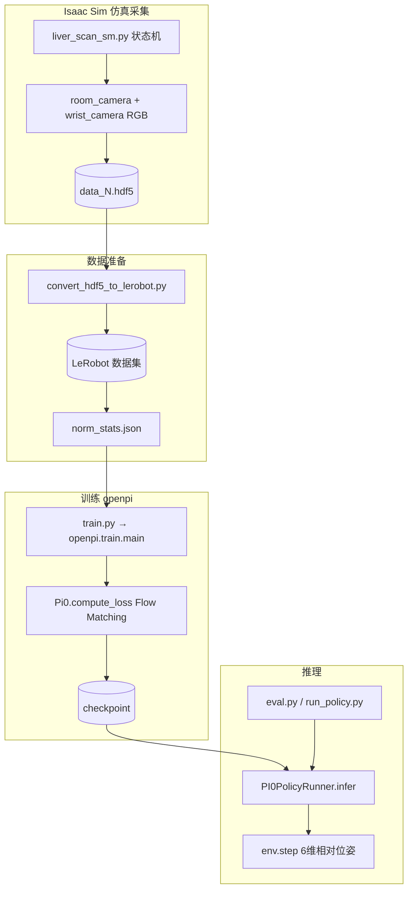
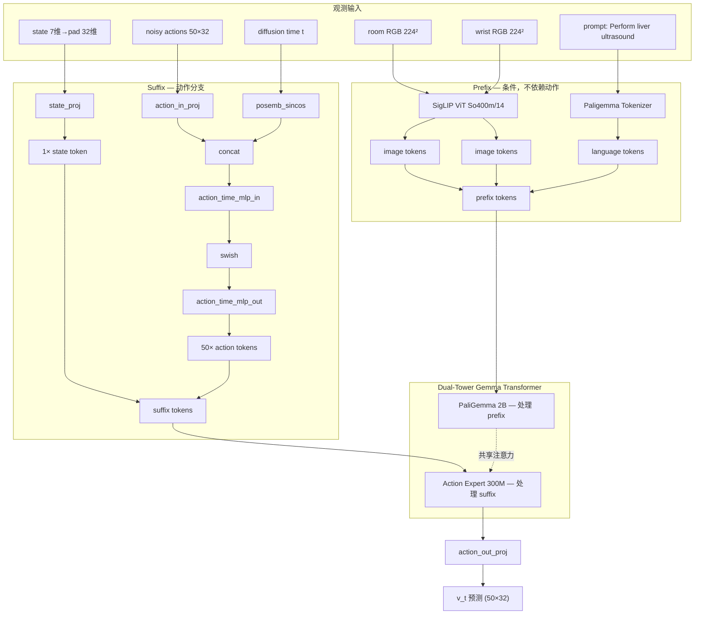
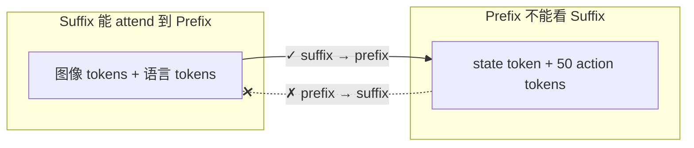
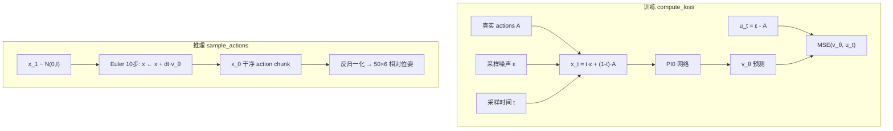

# Robotic ultrasound training and inference
_Exported on 2026/6/28 at GMT+8 23:58:34 from Cursor (3.5.17)_

---

**User**

@robotic_ultrasound 

我现在想要复现 robotic_ultrasound ，我想要结合代码知道pi0是如何进行训练和推理的的，帮我结合当前工作空间，详细解解释下每行代码，完需要全量详细的，深入到pi0的官方源码

我想要知道原始数据 进入pi0网络里面是怎清洗 ，训练的，具体的数学的计算公式，拟合的目标等等 推理又是拿什么画面进行推理的 

---

**Cursor**

正在系统梳理 `robotic_ultrasound` 工作区中 PI0 的训练与推理链路，并追踪到 openpi 官方源码。


接下来我会逐段阅读关键源码：数据转换、训练入口、推理入口，以及 openpi 中的 PI0 模型实现。


下面是一份结合 **本仓库 `robotic_ultrasound` 工作流** 与 **openpi 官方源码**（`third_party/openpi`，commit `581e07d`）的 PI0 训练/推理全链路说明。openpi 源码路径：`third_party/openpi/src/openpi/`。

---

## 0. 总览：数据从哪来，PI0 吃什么，吐什么



**关键结论（先读这个）：**

| 项目 | 内容 |
|------|------|
| **推理用的画面** | **room_camera（第三人称 RGB）+ wrist_camera（腕部/探头 RGB）**，224×224，**不是** 超声 B-mode 图像 |
| **状态 state** | Franka **7 维绝对关节角** `abs_joint_pos` |
| **动作 action** | **6 维相对末端位姿增量**：Δxyz(3) + Δaxis-angle(3)，与 env `Isaac-Teleop-Torso-FrankaUsRs-IK-RL-Rel-v0` 一致 |
| **语言 prompt** | `"Perform a liver ultrasound."` |
| **模型输出** | 一次预测 **50 步 × 6 维** action chunk；eval 每 **5 步** 重新规划 |
| **训练目标** | Flow Matching（预测速度场 \(v_t\)），不是普通 MSE(action) |

---

## 1. 原始数据采集（HDF5）

### 1.1 入口：`liver_scan_sm.py`

状态机自动扫描并写 HDF5。每步调用 `data_collector.record_step(...)`，传入：
- `rel_commands`：6 维相对动作（给 env.step）
- `abs_commands`：绝对目标位姿
- `robot_obs`：末端位姿
- 相机 RGB/depth

相对动作的计算在 `utils.py`：

```112:123:workflows/robotic_ultrasound/scripts/simulation/environments/state_machine/utils.py
def compute_relative_action(action: torch.Tensor, robot_obs: torch.Tensor, return_np: bool = False) -> torch.Tensor:
    """Compute the relative action from the robot observation."""
    pos_sm = action[:, :3]
    rot_sm = action[:, 3:]
    delta_pos, delta_angle = math_utils.compute_pose_error(
        robot_obs[0, :, :3], robot_obs[0, :, 3:], pos_sm, rot_sm, rot_error_type="axis_angle"
    )
    rel_action = torch.cat([delta_pos, delta_angle], dim=-1)
```

数学含义：
\[
a_t = [\Delta p_t;\ \Delta \theta_t] \in \mathbb{R}^6
\]
其中 \(\Delta p\) 是当前 EE 位置到目标位置的差，\(\Delta \theta\) 是 axis-angle 形式的旋转误差。

### 1.2 写入 HDF5：`data_collection_manager.py`

```147:150:workflows/robotic_ultrasound/scripts/simulation/environments/state_machine/data_collection/data_collection_manager.py
        self.collector_interface.add("action", rel_action_np)
        self.collector_interface.add("abs_action", abs_action_np)
        ...
        self.collector_interface.add("abs_joint_pos", abs_joint_pos)
```

HDF5 结构 `data/demo_0/`：

| Key | Shape | 含义 |
|-----|-------|------|
| `action` | (T, 6) | **训练标签**：相对 EE 位姿 |
| `abs_joint_pos` | (T, 7) | **状态**：绝对关节角 |
| `observations/rgb_images` | (T, 2, H, W, 3) | [0]=room, [1]=wrist |
| `observations/depth_images` | (T, 2, H, W) | 可选，PI0 默认不用 |

相机采集：

```126:165:workflows/robotic_ultrasound/scripts/simulation/environments/state_machine/utils.py
def capture_camera_images(env, cam_names, include_seg=False, device="cuda"):
    ...
    for cam_name in cam_names:
        camera_data = env.unwrapped.scene[cam_name].data
        rgb = camera_data.output["rgb"][..., :3].squeeze(0)
        depth = camera_data.output["distance_to_image_plane"].squeeze(0)
```

**room_camera**：俯视/第三人称，看机械臂+床+ phantom。  
**wrist_camera**：装在探头/末端，看接触区域。  
**超声 B-mode** 由独立 raytracing 模块生成，走 DDS 可视化，**不进 PI0**。

---

## 2. HDF5 → LeRobot：`convert_hdf5_to_lerobot.py`

### 2.1 PI0 特征命名：`Pi0FeatureDict`

```190:198:workflows/robotic_ultrasound/scripts/training/convert_hdf5_to_lerobot.py
class Pi0FeatureDict(BaseFeatureDict):
    action_key = "actions"
    room_image_key = "image"
    wrist_image_key = "wrist_image"
    state_key = "state"
```

LeRobot 每帧字段：

| LeRobot key | 来源 HDF5 | 处理 |
|-------------|-----------|------|
| `image` | `rgb_images[0]` | resize_with_pad → 224×224 |
| `wrist_image` | `rgb_images[1]` | 同上 |
| `state` | `abs_joint_pos` | float32 (7,) |
| `actions` | `action` | float32 (6,) |
| `task` | CLI `--task_prompt` | 默认 `"Perform a liver ultrasound."` |

### 2.2 图像 resize（保持宽高比 + 黑边 pad）

```285:305:workflows/robotic_ultrasound/scripts/training/convert_hdf5_to_lerobot.py
def _resize_with_pad_pil(image, height, width, method):
    ratio = max(cur_width / width, cur_height / height)
    resized_height = int(cur_height / ratio)
    resized_width = int(cur_width / ratio)
    resized_image = image.resize((resized_width, resized_height), ...)
    zero_image = Image.new(resized_image.mode, (width, height), 0)
    zero_image.paste(resized_image, (pad_width, pad_height))
```

与 openpi 推理侧 `image_tools.resize_with_pad` 一致，避免 train/test 分布偏移。

### 2.3 主循环（逐帧写入）

```418:457:workflows/robotic_ultrasound/scripts/training/convert_hdf5_to_lerobot.py
    for episode_idx in tqdm.tqdm(episode_names):
        ...
            for step in range(num_steps):
                rgb = f[root_name]["observations/rgb_images"][step]
                state = f[root_name]["abs_joint_pos"][step]
                action = f[root_name]["action"][step]
                frame_dict = feature_builder(rgb=rgb, state=state, action=action, ...)
                dataset.add_frame(frame_dict)
        dataset.save_episode(task=task_prompt)
```

输出目录：`$LEROBOT_HOME/<repo_id>`（默认 `~/.cache/huggingface/lerobot/`）。

---

## 3. 归一化统计：`policy/pi0/utils.py`

训练前自动计算 `norm_stats.json`（若不存在）：

```48:82:workflows/robotic_ultrasound/scripts/policy/pi0/utils.py
def compute_normalization_stats(config, max_frames=None, batch_size=1):
    ...
    keys = ["state", "actions"]
    stats = {key: normalize.RunningStats() for key in keys}
    for batch in tqdm.tqdm(data_loader, ...):
        for key in keys:
            values = np.asarray(batch[key][0])
            stats[key].update(values.reshape(-1, values.shape[-1]))
    norm_stats = {key: stats[key].get_statistics() for key in keys}
    normalize.save(output_path, norm_stats)
```

openpi 默认 **z-score 归一化**（非 quantile）：

\[
x_{\text{norm}} = \frac{x - \mu}{\sigma + \epsilon}, \quad \epsilon = 10^{-6}
\]

反归一化（推理输出）：

\[
x = x_{\text{norm}} \cdot (\sigma + \epsilon) + \mu
\]

因为 PI0 的 `action_dim=32`，7 维 state 和 6 维 action 会被 **pad 到 32 维**，pad 部分的 mean/std=0（见 mock norm_stats）。

---

## 4. 训练配置与入口

### 4.1 入口：`training/pi_zero/train.py`

```54:61:workflows/robotic_ultrasound/scripts/training/pi_zero/train.py
if __name__ == "__main__":
    args = parse_args()
    config = get_config(name=args.config, repo_id=args.repo_id, exp_name=args.exp_name)
    ensure_norm_stats_exist(config)
    train.main(config)   # → openpi/train.py
```

### 4.2 两种配置：`policy/pi0/config.py`

**Full SFT**（>70GB VRAM，30k steps）：
- 全参数微调
- 从 `s3://openpi-assets/checkpoints/pi0_base/params` 加载预训练权重
- EMA 开启

**LoRA**（~22.5GB，推荐）：
- `paligemma_variant=gemma_2b_lora`，`action_expert_variant=gemma_300m_lora`
- `freeze_filter` 冻结非 LoRA 参数
- `ema_decay=None`

共同模型超参（`Pi0Config` 默认）：
- `action_dim = 32`
- `action_horizon = 50`（一次预测未来 50 步）
- `max_token_len = 48`

---

## 5. 训练数据加载：如何把 LeRobot 帧变成 PI0 batch

### 5.1 Action chunk 构造（openpi `data_loader.py`）

```92:100:third_party/openpi/src/openpi/training/data_loader.py
    dataset = lerobot_dataset.LeRobotDataset(
        data_config.repo_id,
        delta_timestamps={
            key: [t / dataset_meta.fps for t in range(model_config.action_horizon)]
            for key in data_config.action_sequence_keys
        },
        ...
    )
```

对 fps=30，在时刻 \(t\) 取：
\[
A_t = [a_t, a_{t+1}, \ldots, a_{t+49}] \in \mathbb{R}^{50 \times 6}
\]
再 pad 到 \(\mathbb{R}^{50 \times 32}\)。

观测取 **同一时刻 \(t\)** 的 image、wrist_image、state（当前帧条件化未来 50 步动作）。

### 5.2 变换链（训练时顺序）

**Step A — RepackTransform**（LeRobot → openpi 键名）：

```152:159:workflows/robotic_ultrasound/scripts/policy/pi0/utils.py
                _transforms.RepackTransform({
                    "observation/image": "image",
                    "observation/wrist_image": "wrist_image",
                    "observation/state": "state",
                    "actions": "actions",
                    "prompt": "prompt",
                })
```

**Step B — Inputs transform**（i4h 定制，映射到 PI0 多相机格式）：

```93:129:workflows/robotic_ultrasound/scripts/policy/pi0/utils.py
    def __call__(self, data: dict) -> dict:
        state = transforms.pad_to_dim(data["observation/state"], self.action_dim)  # 7→32
        base_image = _parse_image(data["observation/image"])
        wrist_image = _parse_image(data["observation/wrist_image"])
        inputs = {
            "state": state,
            "image": {
                "base_0_rgb": base_image,           # room
                "left_wrist_0_rgb": wrist_image,    # wrist
                "right_wrist_0_rgb": np.zeros_like(base_image),  # 占位，mask=False
            },
            "image_mask": {
                "base_0_rgb": True,
                "left_wrist_0_rgb": True,
                "right_wrist_0_rgb": False,         # 第三路相机无效
            },
        }
        if "actions" in data:
            actions = transforms.pad_to_dim(data["actions"], self.action_dim)  # 6→32
            inputs["actions"] = actions
```

**Step C — Normalize**（state/actions z-score）

**Step D — ModelTransformFactory**（openpi `config.py`）：
1. `ResizeImages(224, 224)`（双保险）
2. `TokenizePrompt(PaligemmaTokenizer)` — 把 prompt 变成 token ids

**Step E — `Observation.from_dict`**（uint8 → float32 \([-1,1]\)）：

```110:113:third_party/openpi/src/openpi/models/model.py
        for key in data["image"]:
            if data["image"][key].dtype == np.uint8:
                data["image"][key] = data["image"][key].astype(np.float32) / 255.0 * 2.0 - 1.0
```

---

## 6. PI0 网络结构与数学（openpi 官方 `models/pi0.py`）

PI0 = **PaliGemma（SigLIP 视觉 + Gemma-2B 语言）+ Action Expert（Gemma-300M）+ Flow Matching 动作头**。

### 6.1 模块组成

```144:172:third_party/openpi/src/openpi/models/pi0.py
class Pi0(_model.BaseModel):
    def __init__(self, config, rngs):
        llm = _gemma.Module(configs=[paligemma_config, action_expert_config])  # 双塔 Gemma
        img = _siglip.Module(variant="So400m/14", ...)                        # SigLIP ViT
        self.PaliGemma = nnx.Dict(llm=llm, img=img)
        self.state_proj = nnx.Linear(action_dim, width)      # 7/32 → hidden
        self.action_in_proj = nnx.Linear(action_dim, width)    # noisy action embed
        self.action_time_mlp_in/out = ...                      # 融合 time + action
        self.action_out_proj = nnx.Linear(width, action_dim)   # 预测 v_t
```

### 6.2 Prefix（条件）：图像 + 语言

```175:206:third_party/openpi/src/openpi/models/pi0.py
    def embed_prefix(self, obs):
        for name in obs.images:
            image_tokens, _ = self.PaliGemma.img(obs.images[name], train=False)  # SigLIP patch tokens
            ...
        if obs.tokenized_prompt is not None:
            tokenized_inputs = self.PaliGemma.llm(obs.tokenized_prompt, method="embed")
            tokens.append(tokenized_inputs)
```

- **room** → `base_0_rgb` → SigLIP → 一串 image tokens  
- **wrist** → `left_wrist_0_rgb` → 同上  
- **prompt** → Paligemma tokenizer → language tokens  
- image/language tokens 之间 **全注意力**（非 causal）

### 6.3 Suffix（动作分支）：state + noisy actions + time

```209:238:third_party/openpi/src/openpi/models/pi0.py
    def embed_suffix(self, obs, noisy_actions, timestep):
        state_token = self.state_proj(obs.state)[:, None, :]     # 1 个 state token
        time_emb = posemb_sincos(timestep, ...)                  # 正弦余弦时间编码
        action_tokens = self.action_in_proj(noisy_actions)       # (B, 50, hidden)
        action_time_tokens = MLP(concat(action_tokens, time_emb))
```

Attention 结构（`make_attn_mask`）：
- Prefix（图像+语言）**不能看** suffix（state+action）
- Suffix 可以看 prefix（条件生成）
- 50 个 action token 内部：第 1 个 causal block，其余互相可见

### 6.4 训练损失：Conditional Flow Matching

这是 PI0 的核心，**不是**直接回归 \(a_t\)。

```241:266:third_party/openpi/src/openpi/models/pi0.py
    def compute_loss(self, rng, observation, actions, *, train=False):
        observation = _model.preprocess_observation(preprocess_rng, observation, train=train)
        noise = jax.random.normal(noise_rng, actions.shape)                    # ε ~ N(0,I)
        time = jax.random.beta(time_rng, 1.5, 1, batch_shape) * 0.999 + 0.001 # t ~ Beta(1.5,1)∈(0.001,1)
        x_t = time_expanded * noise + (1 - time_expanded) * actions              # 线性插值路径
        u_t = noise - actions                                                    # 目标速度场
        ...
        v_t = self.action_out_proj(suffix_out[:, -self.action_horizon :])        # 网络预测
        return jnp.mean(jnp.square(v_t - u_t), axis=-1)                          # MSE over action_dim
```

**数学公式：**

设真实动作 chunk 为 \(A \in \mathbb{R}^{50 \times 32}\)（pad 后），采样：
\[
\varepsilon \sim \mathcal{N}(0, I), \quad t \sim \text{Beta}(1.5, 1) \cdot 0.999 + 0.001
\]

构造 flow 路径（Rectified Flow / OT 直线路径）：
\[
x_t = t \cdot \varepsilon + (1 - t) \cdot A
\]

目标速度（conditional flow matching 的解析形式）：
\[
u_t = \varepsilon - A
\]

网络输出 \(v_\theta(x_t, t, \text{obs})\)，损失：
\[
\mathcal{L} = \frac{1}{50 \cdot 32} \sum_{h=1}^{50} \sum_{d=1}^{32} \left(v_{\theta,d}^{(h)} - u_{t,d}^{(h)}\right)^2
\]

训练时对 batch 再 mean。有效维度只有前 6 维有信号（后 26 维 pad 为 0，梯度也趋近 0）。

**训练时图像增强**（`preprocess_observation`, train=True）：
- room 相机：RandomCrop(95%) + Rotate(±5°) + ColorJitter
- wrist 相机：仅 ColorJitter
- 值域在 \([-1,1]\) 与 \([0,1]\) 间切换做 augmax

### 6.5 训练循环：`openpi/train.py`

```136:190:third_party/openpi/src/openpi/train.py
def train_step(config, rng, state, batch):
    chunked_loss = model.compute_loss(rng, observation, actions, train=True)
    loss = jnp.mean(chunked_loss)
    loss, grads = nnx.value_and_grad(loss_fn, ...)(...)
    new_params = optax.apply_updates(params, updates)
    # EMA: ema = decay * ema + (1-decay) * params
```

- Optimizer：optax（AdamW 等，见 TrainConfig 默认）
- 30,000 steps，checkpoint 定期保存
- 初始权重：`pi0_base`（Physical Intelligence 预训练，~11GB）

---

## 7. 推理：用什么画面，怎么出动作

### 7.1 推理入口 A — 仿真 eval：`pi0_policy/eval.py`

```137:157:workflows/robotic_ultrasound/scripts/simulation/imitation_learning/pi0_policy/eval.py
            for t in range(max_timesteps):
                if not action_plan:
                    rgb_images, _, _ = capture_camera_images(
                        env, ["room_camera", "wrist_camera"], device=env.unwrapped.device
                    )
                    room_img = rgb_images[0, 0, ...].cpu().numpy()
                    wrist_img = rgb_images[0, 1, ...].cpu().numpy()
                    action_chunk = policy_runner.infer(
                        room_img=room_img,
                        wrist_img=wrist_img,
                        current_state=get_joint_states(env)[0]   # 7 关节角
                    )
                    action_plan.extend(action_chunk[:replan_steps])  # 取前 5 步
                action = action_plan.popleft()
                obs, ... = env.step(action)   # 6 维相对位姿 → IK env
```

**推理画面总结：**
1. **`room_camera` RGB**：第三人称，看整体场景  
2. **`wrist_camera` RGB**：腕部/探头视角  
3. **不用** depth、seg、超声 B-mode  
4. **state**：当前 7 关节角（不是 EE pose）  
5. **prompt**：`"Perform a liver ultrasound."`

默认 checkpoint：`nvidia/Liver_Scan_Pi0_Cosmos_Rel`（HuggingFace 上 NVIDIA 发布的微调权重）。

### 7.2 推理入口 B — DDS 生产：`policy/run_policy.py`

订阅 DDS topic：
- `topic_room_camera_data_rgb`
- `topic_wrist_camera_data_rgb`
- `topic_franka_info`（关节状态）

30Hz 调用 `PI0PolicyRunner.infer()`，发布 50×6=300 浮点数到 `topic_franka_ctrl`。

### 7.3 `PI0PolicyRunner.infer` 内部

```45:56:workflows/robotic_ultrasound/scripts/policy/pi0/runners.py
    def infer(self, room_img, wrist_img, current_state):
        room_img = image_tools.convert_to_uint8(image_tools.resize_with_pad(room_img, 224, 224))
        wrist_img = image_tools.convert_to_uint8(image_tools.resize_with_pad(wrist_img, 224, 224))
        element = {
            "observation/image": room_img,
            "observation/wrist_image": wrist_img,
            "observation/state": current_state,
            "prompt": self.task_description,
        }
        return self.model.infer(element)["actions"]
```

### 7.4 openpi `Policy.infer` 完整变换链

```41:56:third_party/openpi/src/openpi/policies/policy.py
    def infer(self, obs):
        inputs = self._input_transform(inputs)   # repack → Inputs → Normalize → Tokenize
        inputs = jax.tree.map(lambda x: jnp.asarray(x)[np.newaxis, ...], inputs)  # batch=1
        outputs["actions"] = self._sample_actions(sample_rng, Observation.from_dict(inputs))
        outputs = self._output_transform(outputs)  # Unnormalize → Outputs(取前6维)
```

**推理变换顺序**（`policy_config.create_trained_policy`）：
1. RepackTransform  
2. InjectDefaultPrompt  
3. Inputs（多相机映射 + pad）  
4. **Normalize**（用 checkpoint 里的 norm_stats）  
5. TokenizePrompt + ResizeImages  
6. → `sample_actions`  
7. **Unnormalize**  
8. Outputs：只保留 `actions[:, :6]`

### 7.5 采样：`sample_actions`（10 步 Euler ODE）

```269:325:third_party/openpi/src/openpi/models/pi0.py
    def sample_actions(self, rng, observation, num_steps=10):
        dt = -1.0 / num_steps          # 从 t=1 积到 t=0
        noise = jax.random.normal(rng, (B, 50, 32))   # x_1 = 纯噪声
        # 1) prefix 前向，缓存 KV
        _, kv_cache = self.PaliGemma.llm([prefix_tokens, None], ...)
        # 2) while time >= 0:  Euler 步进
        def step(carry):
            x_t, time = carry
            v_t = action_out_proj(suffix_out)
            return x_t + dt * v_t, time + dt
        x_0, _ = jax.lax.while_loop(cond, step, (noise, 1.0))
        return x_0
```

推理 ODE（与训练路径一致）：
\[
\frac{dx}{dt} = v_\theta(x_t, t, \text{obs}), \quad x_1 \sim \mathcal{N}(0,I), \quad t: 1 \to 0
\]

Euler 离散（10 步，\(\Delta t = -0.1\)）：
\[
x_{t+\Delta t} = x_t + \Delta t \cdot v_\theta(x_t, t, \text{obs})
\]

最终 \(x_0\) 即反归一化后的 action chunk \(\in \mathbb{R}^{50 \times 6}\)。

---

## 8. 端到端张量形状对照表

| 阶段 | room 图 | wrist 图 | state | action |
|------|---------|----------|-------|--------|
| HDF5 | (H,W,3) idx0 | (H,W,3) idx1 | (7,) joint | (6,) rel pose |
| LeRobot | `image` 224³ | `wrist_image` 224³ | `state` (7,) | `actions` (6,) |
| 训练 batch | base_0_rgb [-1,1] | left_wrist_0_rgb | pad→(32,) norm | (50,32) norm |
| 推理输入 | uint8 224³ | uint8 224³ | (7,) raw→norm | — |
| 推理输出 | — | — | — | (50,6) rel pose |
| env.step | — | — | — | 每次执行 1 步 (6,) |

---

## 9. 复现建议命令

```bash
# 1. 采集数据（状态机，写 HDF5）
./i4h run robotic_ultrasound liver_scan_sm --as-root --run-args="--num_episodes 10"

# 2. 转 LeRobot
./i4h run robotic_ultrasound convert_hdf5 --as-root \
  --run-args="--repo_id=my_ultrasound /path/to/hdf5/dir"

# 3. 训练（LoRA，省显存）
python -m training.pi_zero.train \
  --config robotic_ultrasound_lora \
  --exp_name my_exp \
  --repo_id my_ultrasound

# 4. 仿真推理
python -m simulation.imitation_learning.pi0_policy.eval \
  --ckpt_path /path/to/checkpoint \
  --repo_id my_ultrasound
```

---

## 10. 常见误解澄清

1. **PI0 不看超声图**：B-mode 是 raytracing 产物，用于 DearPyGUI/临床可视化；策略只看 **两个 RGB 仿真相机**。  
2. **action 不是关节增量**：HDF5 的 `action` 是 **6D 相对 EE 位姿**（IK-Rel env）；`state` 才是 7 关节角。  
3. **不是行为克隆 CE/MSE(action)**：是 **Flow Matching**，拟合速度场 \(u_t = \varepsilon - A\)。  
4. **一次预测 50 步，但只执行 5 步**：这叫 receding horizon / model predictive control 风格 replanning。  
5. **第三路相机 `right_wrist_0_rgb`**：全零 + mask=False，因为 Franka 单臂只有腕部一路有效相机。

---

如果你希望继续深入某一块，我可以按你的优先级展开，例如：
- **SigLIP 如何把 224×224 变成 token 序列**（`siglip.py` 逐层）
- **Gemma dual-tower attention 的 einsum 细节**（`gemma.py`）
- **LoRA 哪些层可训练**（`get_freeze_filter` + `lora.py`）
- **与 agentic 栈 `ultrasound_liver_scan` 的差异**（Zenoh vs DDS，LeRobot key 命名不同）

---

**User**

@third_party/openpi/src/openpi/models/pi0.py:169-172 
1.nnx是什么意思，nnx.Linear是什么意思，action_expert_config.width是什么意思
2 action_time_mlp_in 和 action_time_mlp_out 是什么意思，为什么2个不同
帮忙解释下，最好画个pi0的架构图帮我辅助理解下

---

**Cursor**

先对照 `pi0.py` 和 `gemma.py` 里这几层的定义与调用关系，再说明 `nnx`、`action_expert_config.width` 以及两个 MLP 各自做什么。


下面按你标出的 `pi0.py:169-172` 逐层说明，并配上 PI0 整体架构图。

---

## 1. `nnx` 是什么？`nnx.Linear` 是什么？

### `nnx` = Flax 的新一代神经网络 API

PI0 用 **JAX + Flax**。Flax 有两套写法：

| API | 风格 | PI0 里用在哪 |
|-----|------|-------------|
| **Linen** (`flax.linen`) | 老式，函数式 | SigLIP、Gemma 本体（再通过 bridge 包一层） |
| **NNX** (`flax.nnx`) | 新式，更像 PyTorch 的 `nn.Module` | `state_proj`、`action_in_proj`、MLP、输出头等 |

代码里有一句注释说明了原因：

```149:149:third_party/openpi/src/openpi/models/pi0.py
        # TODO: rewrite gemma in NNX. For now, use bridge.
```

Gemma / SigLIP 还是 Linen 写的，用 `nnx_bridge.ToNNX(...)` 桥接；**动作相关的几层直接用 NNX 写**，方便和训练循环（`nnx.value_and_grad`）对接。

### `nnx.Linear` = 全连接层（仿射变换）

等价于 PyTorch 的 `nn.Linear`：

\[
y = x W^\top + b
\]

例如：

```python
nnx.Linear(config.action_dim, action_expert_config.width, rngs=rngs)
```

表示：输入维度 `action_dim`（默认 **32**）→ 输出维度 `width`（见下）。

`rngs=rngs` 是 NNX 初始化随机权重用的随机数生成器。

---

## 2. `action_expert_config.width` 是什么？

PI0 的 LLM 是 **双塔 Gemma**：一个大的 PaliGemma（2B），一个小的 **Action Expert**（300M）。

```147:148:third_party/openpi/src/openpi/models/pi0.py
        paligemma_config = _gemma.get_config(config.paligemma_variant)
        action_expert_config = _gemma.get_config(config.action_expert_variant)
```

`width` 是 Gemma 配置里的 **隐藏维度 \(d_{\text{model}}\)**，也就是每个 token 的 embedding 宽度，必须和 Transformer 内部一致：

```69:77:third_party/openpi/src/openpi/models/gemma.py
    if variant == "gemma_300m":
        return Config(
            width=1024,      # ← action_expert_config.width
            depth=18,
            mlp_dim=4096,
            ...
        )
```

默认配置下：

| 模块 | variant | `width` |
|------|---------|---------|
| PaliGemma（视觉+语言） | `gemma_2b` | **2048** |
| Action Expert（动作） | `gemma_300m` | **1024** |

所以 `action_in_proj` 等层都要把动作向量 **投影到 1024 维**，才能作为 token 送进 Action Expert 那路 Transformer。

---

## 3. `action_time_mlp_in` 和 `action_time_mlp_out` 是什么？为什么两个？

它们不是两套独立模块，而是 **一个 2 层 MLP 的第一层和第二层**，在 `embed_suffix` 里这样用：

```222:230:third_party/openpi/src/openpi/models/pi0.py
        time_emb = posemb_sincos(timestep, self.action_in_proj.out_features, ...)
        action_tokens = self.action_in_proj(noisy_actions)           # (B, 50, 1024)
        time_tokens = einops.repeat(time_emb, "b emb -> b s emb", s=self.action_horizon)
        action_time_tokens = jnp.concatenate([action_tokens, time_tokens], axis=-1)  # (B, 50, 2048)
        action_time_tokens = self.action_time_mlp_in(action_time_tokens)   # 2048 → 1024
        action_time_tokens = nnx.swish(action_time_tokens)                 # 非线性
        action_time_tokens = self.action_time_mlp_out(action_time_tokens)  # 1024 → 1024
```

数据流（设 `width = 1024`，`action_horizon = 50`）：

```
noisy_actions (B, 50, 32)
        │
        ▼ action_in_proj
action_tokens (B, 50, 1024)
        │
        │     timestep t (B,) ──► posemb_sincos ──► time_emb (B, 1024) ──► repeat ──► (B, 50, 1024)
        │
        └──── concat ────► (B, 50, 2048)   ← 2×width，所以第一层是 Linear(2*width, width)
                    │
                    ▼ action_time_mlp_in
               (B, 50, 1024)
                    │
                    ▼ swish (激活)
                    │
                    ▼ action_time_mlp_out
               (B, 50, 1024)  ← 最终 50 个 action token，送入 Gemma
```

### 为什么要两个 Linear，而不是一个？

1. **先 concat 再压维**：动作 embedding 和时间 embedding 各 1024 维，拼起来 2048 维；`mlp_in` 负责 **融合并压回** 1024，才能和 Transformer 的 token 维度一致。
2. **中间加非线性**：只有一层线性的话，等价于 \(W[a;t]\)，表达力弱；`mlp_in → swish → mlp_out` 是标准 **2-layer MLP**，能学更复杂的「在 diffusion 时间 \(t\) 下，noisy action 该怎么编码」。
3. **命名习惯**：Transformer 里 FFN 也常叫 `mlp_in` / `mlp_out`（或 gate/up/down），这里沿用类似命名。

类比：像一个小型 FFN block，但专门给 **(action, time)** 融合用，不经过 Gemma 里那 18 层大 FFN。

---

## 4. 你标出的 4 行各自干什么

```169:172:third_party/openpi/src/openpi/models/pi0.py
        self.action_in_proj = nnx.Linear(config.action_dim, action_expert_config.width, rngs=rngs)
        self.action_time_mlp_in = nnx.Linear(2 * action_expert_config.width, action_expert_config.width, rngs=rngs)
        self.action_time_mlp_out = nnx.Linear(action_expert_config.width, action_expert_config.width, rngs=rngs)
        self.action_out_proj = nnx.Linear(action_expert_config.width, config.action_dim, rngs=rngs)
```

| 层 | 输入 → 输出 | 作用 |
|----|-------------|------|
| `action_in_proj` | 32 → 1024 | 把每步 noisy action 变成 token |
| `action_time_mlp_in` | 2048 → 1024 | 融合 action + time 的第一层 |
| `action_time_mlp_out` | 1024 → 1024 | 融合后的精炼 |
| `action_out_proj` | 1024 → 32 | 从 Transformer 输出预测速度场 \(v_t\)（训练）或用于 ODE 步进（推理） |

旁边还有一行 `state_proj`（168 行）：把机器人 state 32 维 → 1024 维，变成 **1 个 state token**。

---

## 5. PI0 整体架构图

### 5.1 宏观：Prefix + Suffix 双段 Transformer



### 5.2 Attention 方向（谁看谁）



含义：图像和语言只当 **条件**；state/action 可以看场景和指令，但场景不会「偷看」当前 noisy action（避免信息泄漏，符合 flow matching 设定）。

### 5.3 训练 vs 推理



---

## 6. 和 robotic_ultrasound 的对应关系（帮助串起来）

| 概念 | 在本项目里 |
|------|-----------|
| `action_dim=32` | 6 维相对位姿 + 26 维 zero pad |
| `action_horizon=50` | 一次预测未来 50 步；eval 每 5 步重规划 |
| `width=1024` | Action Expert 内部维度；你的 4 行 Linear 都对齐这个数 |
| Prefix 图像 | room + wrist RGB（不是超声 B-mode） |
| `action_out_proj` 输出 | 经 Unnormalize 后取前 6 维 → `env.step` |

---

## 7. 一句话总结

- **`nnx`**：Flax 的模块式 API；**`nnx.Linear`**：全连接层。  
- **`action_expert_config.width`**：Action Expert（Gemma-300M）的隐藏维 **1024**，所有动作 token 必须投影到这个维度。  
- **`action_time_mlp_in/out`**：把 **noisy action embedding** 和 **时间 embedding** 拼起来后，用 **两层 MLP + swish** 融合成 50 个 action token；两个 Linear 是同一个 MLP 的「扩维融合层」和「精炼层」，不是两套无关网络。

如果你想继续往下挖，我可以单独画 **Gemma dual-tower 里 prefix/suffix 怎么共享 attention**（`gemma.py` 里的 einsum），或者把 **50 个 action token 的 causal mask** 用示意图展开。

