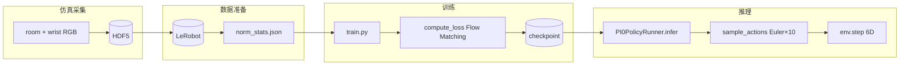
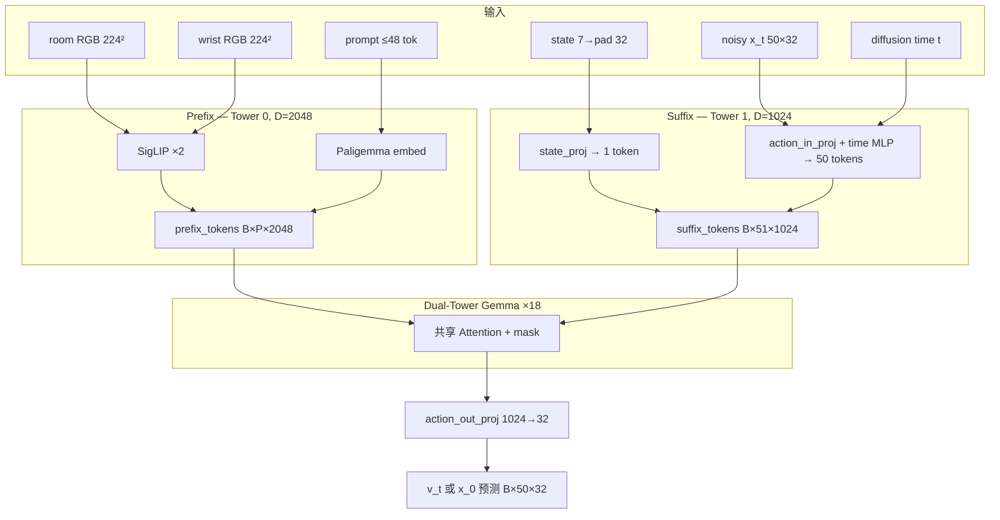
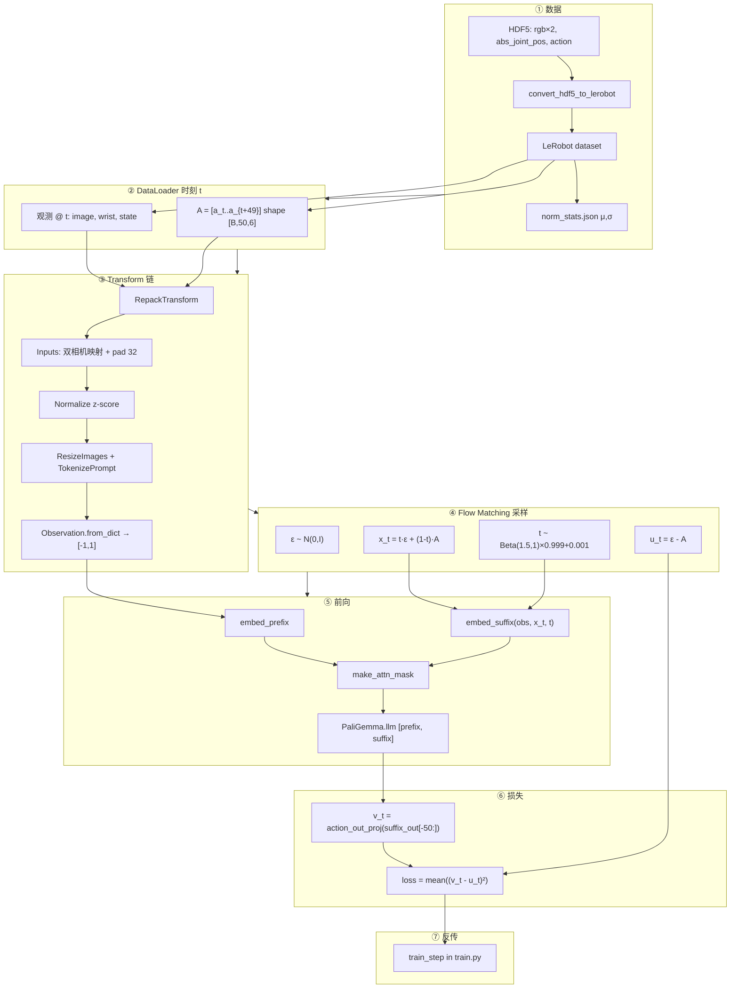
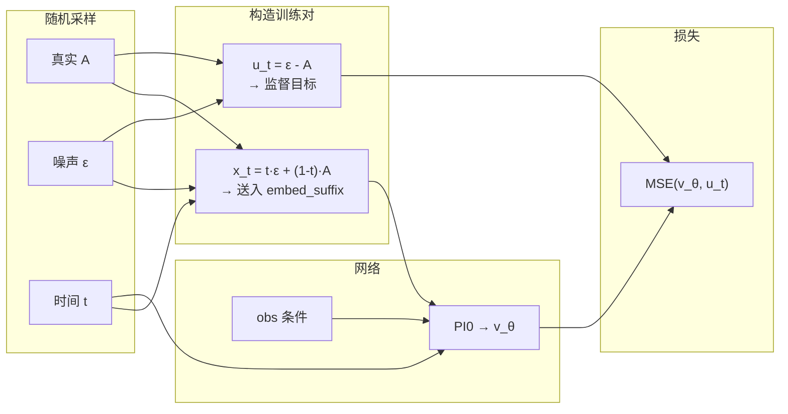
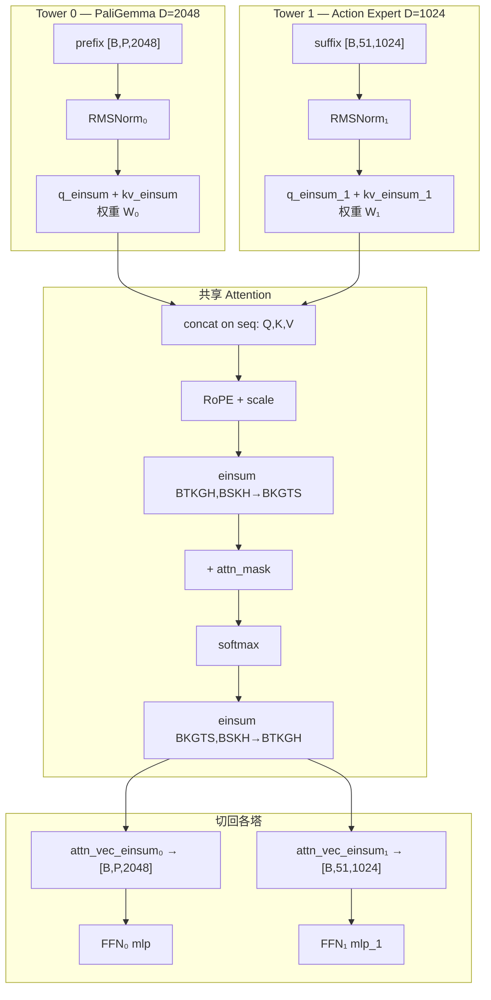
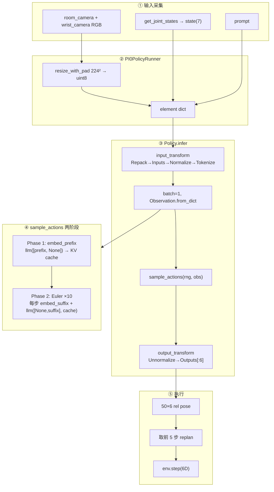

# PI0 训练与推理深度解析

> 基于本仓库 `robotic_ultrasound` 工作流与 openpi 官方源码（`third_party/openpi/src/openpi/`）。  
> 核心模型文件：`models/pi0.py`、`models/gemma.py`、`models/siglip.py`。

---

## 目录

1. [总览](#1-总览)
2. [源码索引](#2-源码索引)
3. [模型结构](#3-模型结构)
4. [训练全流程](#4-训练全流程)
5. [Flow Matching 详解](#5-flow-matching-详解)
6. [Prefix / Suffix 嵌入](#6-prefix--suffix-嵌入)
7. [双塔 Gemma 与共享 Attention](#7-双塔-gemma-与共享-attention)
8. [Attention Mask 机制](#8-attention-mask-机制)
9. [推理全流程](#9-推理全流程)
10. [训练 vs 推理对比](#10-训练-vs-推理对比)
11. [robotic_ultrasound 参数对照](#11-robotic_ultrasound-参数对照)
12. [常见误解](#12-常见误解)

---

## 1. 总览

PI0 = **SigLIP 视觉编码器** + **双塔 Gemma Transformer**（PaliGemma 2B + Action Expert 300M）+ **Flow Matching 动作头**。

| 项目 | 内容 |
|------|------|
| 推理画面 | `room_camera` + `wrist_camera` RGB（224×224），**不是**超声 B-mode |
| 状态 `state` | Franka 7 维绝对关节角，pad 到 32 维 |
| 动作 `action` | 6 维相对末端位姿增量（Δxyz + Δaxis-angle），pad 到 32 维 |
| 语言 prompt | `"Perform a liver ultrasound."` |
| 一次预测 | 50 步 × 6 维 action chunk |
| 执行策略 | eval 每 **5 步**重新规划（receding horizon） |
| 训练目标 | Flow Matching：拟合速度场 \(u_t = \varepsilon - A\)，**不是**直接 MSE(action) |



---

## 2. 源码索引

| 功能 | 路径 |
|------|------|
| PI0 模型（loss / 采样 / mask） | `third_party/openpi/src/openpi/models/pi0.py` |
| 双塔 Gemma（attention einsum） | `third_party/openpi/src/openpi/models/gemma.py` |
| SigLIP 视觉编码 | `third_party/openpi/src/openpi/models/siglip.py` |
| 训练循环 | `third_party/openpi/src/openpi/train.py` |
| DataLoader + action chunk | `third_party/openpi/src/openpi/training/data_loader.py` |
| Policy 推理入口 | `third_party/openpi/src/openpi/policies/policy.py` |
| i4h 数据映射 / norm | `workflows/robotic_ultrasound/scripts/policy/pi0/utils.py` |
| i4h 推理封装 | `workflows/robotic_ultrasound/scripts/policy/pi0/runners.py` |
| 仿真 eval | `workflows/robotic_ultrasound/scripts/simulation/imitation_learning/pi0_policy/eval.py` |

---

## 3. 模型结构

### 3.1 默认超参（`Pi0Config`）

```67:76:third_party/openpi/src/openpi/models/pi0.py
@dataclasses.dataclass(frozen=True)
class Pi0Config(_model.BaseModelConfig):
    dtype: str = "bfloat16"
    paligemma_variant: _gemma.Variant = "gemma_2b"
    action_expert_variant: _gemma.Variant = "gemma_300m"

    # Set the model specific defaults.
    action_dim: int = 32
    action_horizon: int = 50
    max_token_len: int = 48
```

### 3.2 模块组成（`Pi0.__init__`）

```144:172:third_party/openpi/src/openpi/models/pi0.py
class Pi0(_model.BaseModel):
    def __init__(self, config: Pi0Config, rngs: nnx.Rngs):
        ...
        llm = nnx_bridge.ToNNX(
            _gemma.Module(
                configs=[paligemma_config, action_expert_config],
                embed_dtype=config.dtype,
            )
        )
        ...
        img = nnx_bridge.ToNNX(
            _siglip.Module(
                num_classes=paligemma_config.width,
                variant="So400m/14",
                pool_type="none",
                ...
            )
        )
        ...
        self.state_proj = nnx.Linear(config.action_dim, action_expert_config.width, rngs=rngs)
        self.action_in_proj = nnx.Linear(config.action_dim, action_expert_config.width, rngs=rngs)
        self.action_time_mlp_in = nnx.Linear(2 * action_expert_config.width, action_expert_config.width, rngs=rngs)
        self.action_time_mlp_out = nnx.Linear(action_expert_config.width, action_expert_config.width, rngs=rngs)
        self.action_out_proj = nnx.Linear(action_expert_config.width, config.action_dim, rngs=rngs)
```

| 模块 | variant | `width` | 作用 |
|------|---------|---------|------|
| PaliGemma（Tower 0） | `gemma_2b` | 2048 | 处理 prefix（图像 + 语言 token） |
| Action Expert（Tower 1） | `gemma_300m` | 1024 | 处理 suffix（state + action token） |
| SigLIP | `So400m/14` | 内部 1152 → head 2048 | 每路相机 224² → 256 patch token |

两塔共享：`num_heads=8`, `num_kv_heads=1`, `head_dim=256`, `depth=18`（见 `gemma.py` `get_config`）。

### 3.3 宏观架构图



---

## 4. 训练全流程

### 4.1 端到端流图



### 4.2 Action chunk 构造

DataLoader 在时刻 \(t\) 取未来 50 步动作（fps=30 时覆盖约 1.67s）：

```92:100:third_party/openpi/src/openpi/training/data_loader.py
    dataset = lerobot_dataset.LeRobotDataset(
        data_config.repo_id,
        delta_timestamps={
            key: [t / dataset_meta.fps for t in range(model_config.action_horizon)]
            for key in data_config.action_sequence_keys
        },
        ...
    )
```

### 4.3 i4h Transform 链

**RepackTransform + Inputs**（`policy/pi0/utils.py`）：

```105:117:workflows/robotic_ultrasound/scripts/policy/pi0/utils.py
        inputs = {
            "state": state,
            "image": {
                "base_0_rgb": base_image,
                "left_wrist_0_rgb": wrist_image,
                "right_wrist_0_rgb": np.zeros_like(base_image),
            },
            "image_mask": {
                "base_0_rgb": np.True_,
                "left_wrist_0_rgb": np.True_,
                "right_wrist_0_rgb": np.False_ if mask_padding else np.True_,
            },
        }
```

训练时 Transform 顺序（`data_loader.transform_dataset`）：

1. `repack_transforms`
2. `data_transforms`（Inputs）
3. `Normalize`
4. `model_transforms`（ResizeImages + TokenizePrompt）

### 4.4 `compute_loss` 核心逻辑

```241:266:third_party/openpi/src/openpi/models/pi0.py
    def compute_loss(self, rng, observation, actions, *, train=False):
        preprocess_rng, noise_rng, time_rng = jax.random.split(rng, 3)
        observation = _model.preprocess_observation(preprocess_rng, observation, train=train)

        noise = jax.random.normal(noise_rng, actions.shape)
        time = jax.random.beta(time_rng, 1.5, 1, batch_shape) * 0.999 + 0.001
        time_expanded = time[..., None, None]
        x_t = time_expanded * noise + (1 - time_expanded) * actions
        u_t = noise - actions

        prefix_tokens, prefix_mask, prefix_ar_mask = self.embed_prefix(observation)
        suffix_tokens, suffix_mask, suffix_ar_mask = self.embed_suffix(observation, x_t, time)
        ...
        attn_mask = make_attn_mask(input_mask, ar_mask)
        positions = jnp.cumsum(input_mask, axis=1) - 1
        (prefix_out, suffix_out), _ = self.PaliGemma.llm(
            [prefix_tokens, suffix_tokens], mask=attn_mask, positions=positions
        )
        v_t = self.action_out_proj(suffix_out[:, -self.action_horizon :])

        return jnp.mean(jnp.square(v_t - u_t), axis=-1)
```

### 4.5 `train_step` 反传

```136:157:third_party/openpi/src/openpi/train.py
def train_step(config, rng, state, batch):
    model = nnx.merge(state.model_def, state.params)
    model.train()

    def loss_fn(model, rng, observation, actions):
        chunked_loss = model.compute_loss(rng, observation, actions, train=True)
        return jnp.mean(chunked_loss)

    train_rng = jax.random.fold_in(rng, state.step)
    observation, actions = batch
    loss, grads = nnx.value_and_grad(loss_fn, ...)(model, train_rng, observation, actions)
    ...
```

---

## 5. Flow Matching 详解

### 5.1 数学公式

设真实动作 chunk 为 \(A \in \mathbb{R}^{50 \times 32}\)（pad 后），每步训练采样：

\[
\varepsilon \sim \mathcal{N}(0, I), \quad t \sim \text{Beta}(1.5, 1) \cdot 0.999 + 0.001
\]

**直线路径（Rectified Flow）：**

\[
x_t = t \cdot \varepsilon + (1 - t) \cdot A
\]

**解析目标速度场：**

\[
u_t = \varepsilon - A
\]

网络输出 \(v_\theta(x_t, t, \text{obs})\)，损失：

\[
\mathcal{L} = \frac{1}{50 \cdot 32} \sum_{h=1}^{50} \sum_{d=1}^{32} \left(v_{\theta,d}^{(h)} - u_{t,d}^{(h)}\right)^2
\]

对 batch 再取 mean。有效梯度主要在前 **6 维**（后 26 维 pad 为 0）。

### 5.2 时间 convention（重要）

openpi 代码注释说明：**t=1 是噪声，t=0 是目标分布**（与部分论文写法相反）：

```277:278:third_party/openpi/src/openpi/models/pi0.py
        # note that we use the convention more common in diffusion literature, where t=1 is noise and t=0 is the target
        # distribution. yes, this is the opposite of the pi0 paper, and I'm sorry.
```

| t 值 | \(x_t\) 近似 | 网络学什么 |
|------|-------------|-----------|
| t ≈ 1 | 纯噪声 ε | 如何离开噪声流形 |
| t ≈ 0.5 | 半噪声半真值 | 中间态去噪方向 |
| t ≈ 0 | 真值 A | \(v_\theta \to \varepsilon - A\) |

### 5.3 Flow Matching 流图



**注意：** \(x_t\) 是网络**输入**，\(u_t\) 是**监督目标**。不是直接回归 \(A\) 或 \(x_0\)。

---

## 6. Prefix / Suffix 嵌入

### 6.1 `embed_prefix` — 图像 + 语言

```175:206:third_party/openpi/src/openpi/models/pi0.py
    def embed_prefix(self, obs):
        ...
        for name in obs.images:
            image_tokens, _ = self.PaliGemma.img(obs.images[name], train=False)
            tokens.append(image_tokens)
            ...
            ar_mask += [False] * image_tokens.shape[1]

        if obs.tokenized_prompt is not None:
            tokenized_inputs = self.PaliGemma.llm(obs.tokenized_prompt, method="embed")
            tokens.append(tokenized_inputs)
            ...
            ar_mask += [False] * tokenized_inputs.shape[1]
        ...
```

- 每路 224×224 图像经 SigLIP/14 → **256** patch token（\(224/14=16\)，\(16^2=256\)）
- SigLIP 内部 width=1152，最后 `Dense(2048)` 对齐 Gemma（`num_classes=paligemma_config.width`）
- 语言 token 经 PaliGemma `embedder` → 2048 维
- 所有 prefix token 的 `ar_mask=False` → **内部双向全连接**

**robotic_ultrasound prefix 长度：**

\[
P = 2 \times 256 + L_{\text{prompt}} \approx 560 \quad (L_{\text{prompt}} \le 48)
\]

### 6.2 `embed_suffix` — state + noisy action + time

```209:238:third_party/openpi/src/openpi/models/pi0.py
    def embed_suffix(self, obs, noisy_actions, timestep):
        state_token = self.state_proj(obs.state)[:, None, :]
        ...
        ar_mask += [True]

        time_emb = posemb_sincos(timestep, self.action_in_proj.out_features, min_period=4e-3, max_period=4.0)
        action_tokens = self.action_in_proj(noisy_actions)
        time_tokens = einops.repeat(time_emb, "b emb -> b s emb", s=self.action_horizon)
        action_time_tokens = jnp.concatenate([action_tokens, time_tokens], axis=-1)
        action_time_tokens = self.action_time_mlp_in(action_time_tokens)
        action_time_tokens = nnx.swish(action_time_tokens)
        action_time_tokens = self.action_time_mlp_out(action_time_tokens)
        ...
        ar_mask += [True] + ([False] * (self.action_horizon - 1))
```

数据流（`width=1024`）：

```
state [B,32] ──state_proj──► [B,1,1024]

x_t [B,50,32] ──action_in_proj──► [B,50,1024]
t [B] ──posemb_sincos──► [B,1024] ──repeat──► [B,50,1024]
        └─ concat [B,50,2048] ── mlp_in → swish → mlp_out ──► [B,50,1024]

suffix = concat(state, action_time) → [B, 51, 1024]
```

### 6.3 Suffix 各层 Linear 对照

| 层 | 输入 → 输出 | 源码行 |
|----|-------------|--------|
| `state_proj` | 32 → 1024 | pi0.py:168 |
| `action_in_proj` | 32 → 1024 | pi0.py:169 |
| `action_time_mlp_in` | 2048 → 1024 | pi0.py:170 |
| `action_time_mlp_out` | 1024 → 1024 | pi0.py:171 |
| `action_out_proj` | 1024 → 32 | pi0.py:172 |

---

## 7. 双塔 Gemma 与共享 Attention

### 7.1 单层 Block 流图（×18 重复）



### 7.2 关键 einsum（`gemma.py` Attention）

**各塔独立 QKV：**

```183:191:third_party/openpi/src/openpi/models/gemma.py
                q = q_einsum("BTD,NDH->BTNH", x)
                ...
                k, v = kv_einsum("BSD,2KDH->2BSKH", x)
```

**序列维拼接：**

```193:193:third_party/openpi/src/openpi/models/gemma.py
        q, k, v = (jnp.concatenate(y, axis=1) for y in zip(*qkvs, strict=True))
```

**共享 attention：**

```208:223:third_party/openpi/src/openpi/models/gemma.py
        q = einops.rearrange(q, "B T (K G) H -> B T K G H", K=self.configs[0].num_kv_heads)
        logits = jnp.einsum("BTKGH,BSKH->BKGTS", q, k, preferred_element_type=jnp.float32)
        ...
        probs = jax.nn.softmax(masked_logits, axis=-1).astype(dtype)
        encoded = jnp.einsum("BKGTS,BSKH->BTKGH", probs, v)
```

**切回 + 各塔 output proj：**

```225:236:third_party/openpi/src/openpi/models/gemma.py
        for i, (x, config) in enumerate(zip(xs, self.configs, strict=True)):
            if x is not None:
                end = start + x.shape[1]
                ...
                out.append(out_einsum("BTNH,NHD->BTD", encoded[:, start:end]))
```

### 7.3 要点澄清

| 说法 | 对错 |
|------|------|
| 「2048+1024→3072 拼特征做 QKV」 | ❌ 错误。各塔用**独立权重**投影，在**序列维** concat |
| 「MoE 动态路由」 | ❌ 错误。固定双塔：prefix→Tower0，suffix→Tower1 |
| 「Attention 共享，FFN 独立」 | ✅ 正确 |
| 「推理时 prefix K/V 可缓存」 | ✅ 正确（见第 9 节） |

---

## 8. Attention Mask 机制

### 8.1 `make_attn_mask` 算法

```20:45:third_party/openpi/src/openpi/models/pi0.py
def make_attn_mask(input_mask, mask_ar):
    mask_ar = jnp.broadcast_to(mask_ar, input_mask.shape)
    cumsum = jnp.cumsum(mask_ar, axis=1)
    attn_mask = cumsum[:, None, :] <= cumsum[:, :, None]
    valid_mask = input_mask[:, None, :] * input_mask[:, :, None]
    return jnp.logical_and(attn_mask, valid_mask)
```

规则：**query 位置 i 能 attend key 位置 j，当且仅当 `cumsum[j] ≤ cumsum[i]`**（且双方非 padding）。

`mask_ar=True` 表示「从这里开始新的 attention block」，不是普通 causal 的「只能看左边一个」。

### 8.2 PI0 的 ar_mask 设置

| 段 | ar_mask | cumsum | 能看谁 |
|----|---------|--------|--------|
| Prefix（图像+语言） | 全 `False` | 0 | 仅 prefix |
| State token | `True` | 1 | prefix + 自己 |
| Action token 0 | `True` | 2 | prefix + state + 全部 action |
| Action token 1..49 | `False` | 2 | 同上 |

源码：

```219:234:third_party/openpi/src/openpi/models/pi0.py
        ar_mask += [True]          # state
        ...
        ar_mask += [True] + ([False] * (self.action_horizon - 1))  # actions
```

### 8.3 Mask 示意图

全长 \(L = P + 51\)。`✓`=可见，`✗`=不可见。行=Query，列=Key。

**跨 prefix / suffix：**

```
                    Keys →
              [ Prefix | S | Actions(50) ]
           ┌──────────┬───┬─────────────┐
 Prefix Q  │  ✓✓✓✓✓  │ ✗ │   ✗✗✗✗✗   │
      S Q  │  ✓✓✓✓✓  │ ✓ │   ✗✗✗✗✗   │
 Action Q  │  ✓✓✓✓✓  │ ✓ │  ✓✓✓✓✓✓✓  │
           └──────────┴───┴─────────────┘
```

**50 个 action 之间：全互看（非 step-wise causal）**

```
A0 ↔ A1 ↔ A2 ↔ ... ↔ A49    （50×50 全 ✓）
```

`ar_mask` 中 A0 的 `True` 只为隔开 state 与 action block，**不是**让 A1 只能看 A0。

---

## 9. 推理全流程

### 9.1 端到端流图



### 9.2 `PI0PolicyRunner.infer`

```45:56:workflows/robotic_ultrasound/scripts/policy/pi0/runners.py
    def infer(self, room_img, wrist_img, current_state) -> torch.Tensor:
        room_img = image_tools.convert_to_uint8(image_tools.resize_with_pad(room_img, 224, 224))
        wrist_img = image_tools.convert_to_uint8(image_tools.resize_with_pad(wrist_img, 224, 224))
        element = {
            "observation/image": room_img,
            "observation/wrist_image": wrist_img,
            "observation/state": current_state,
            "prompt": self.task_description,
        }
        return self.model.infer(element)["actions"]
```

### 9.3 `Policy.infer` → `sample_actions`

```41:56:third_party/openpi/src/openpi/policies/policy.py
    def infer(self, obs: dict) -> dict:
        inputs = self._input_transform(inputs)
        inputs = jax.tree.map(lambda x: jnp.asarray(x)[np.newaxis, ...], inputs)
        ...
        outputs = {
            "actions": self._sample_actions(sample_rng, _model.Observation.from_dict(inputs), **self._sample_kwargs),
        }
        outputs = jax.tree.map(lambda x: np.asarray(x[0, ...]), outputs)
        return self._output_transform(outputs)
```

### 9.4 `sample_actions` — KV Cache + Euler ODE

```269:325:third_party/openpi/src/openpi/models/pi0.py
    def sample_actions(self, rng, observation, *, num_steps=10):
        observation = _model.preprocess_observation(None, observation, train=False)
        dt = -1.0 / num_steps
        noise = jax.random.normal(rng, (batch_size, self.action_horizon, self.action_dim))

        # Phase 1: prefix → KV cache
        prefix_tokens, prefix_mask, prefix_ar_mask = self.embed_prefix(observation)
        prefix_attn_mask = make_attn_mask(prefix_mask, prefix_ar_mask)
        positions = jnp.cumsum(prefix_mask, axis=1) - 1
        _, kv_cache = self.PaliGemma.llm([prefix_tokens, None], mask=prefix_attn_mask, positions=positions)

        def step(carry):
            x_t, time = carry
            suffix_tokens, suffix_mask, suffix_ar_mask = self.embed_suffix(observation, x_t, ...)
            suffix_attn_mask = make_attn_mask(suffix_mask, suffix_ar_mask)
            prefix_attn_mask = einops.repeat(prefix_mask, "b p -> b s p", s=suffix_tokens.shape[1])
            full_attn_mask = jnp.concatenate([prefix_attn_mask, suffix_attn_mask], axis=-1)
            positions = jnp.sum(prefix_mask, axis=-1)[:, None] + jnp.cumsum(suffix_mask, axis=-1) - 1
            (prefix_out, suffix_out), _ = self.PaliGemma.llm(
                [None, suffix_tokens], mask=full_attn_mask, positions=positions, kv_cache=kv_cache
            )
            v_t = self.action_out_proj(suffix_out[:, -self.action_horizon :])
            return x_t + dt * v_t, time + dt

        x_0, _ = jax.lax.while_loop(cond, step, (noise, 1.0))
        return x_0
```

### 9.5 ODE 10 步展开

| Step | time | x_t | 计算内容 |
|------|------|-----|----------|
| init | 1.0 | ε ~ N(0,I) | — |
| 1 | 1.0→0.9 | x += (-0.1)·v_θ | suffix 前向，prefix 用 cache |
| 2 | 0.9→0.8 | 同上 | 同上 |
| ... | ... | ... | ... |
| 10 | 0.1→0.0 | x_0 ≈ 干净 chunk | 返回 |

**推理 ODE（与训练路径一致）：**

\[
\frac{dx}{dt} = v_\theta(x_t, t, \text{obs}), \quad x_1 \sim \mathcal{N}(0,I), \quad t: 1 \to 0
\]

Euler 离散（10 步，\(\Delta t = -0.1\)）：

\[
x_{t+\Delta t} = x_t + \Delta t \cdot v_\theta(x_t, t, \text{obs})
\]

### 9.6 推理时 mask 与训练的区别

| | 训练 | 推理 |
|---|------|------|
| mask 形状 | `[B, P+51, P+51]` 方阵 | `[B, 51, P+51]`（仅 suffix 产生 Q） |
| prefix 前向 | 与 suffix 同次 | **单独一次**，结果进 cache |
| suffix 前向 | 1 次 | **10 次**（ODE 每步） |
| Tower 0 | 每步参与 | Phase 1 后不再重算 |

推理 mask 拼接逻辑（源码注释）：

```294:302:third_party/openpi/src/openpi/models/pi0.py
            # suffix_attn_mask: (b, suffix_len, suffix_len)
            suffix_attn_mask = make_attn_mask(suffix_mask, suffix_ar_mask)
            # prefix_attn_mask: (b, suffix_len, prefix_len) — suffix Q 看 prefix K
            prefix_attn_mask = einops.repeat(prefix_mask, "b p -> b s p", s=suffix_tokens.shape[1])
            # full_attn_mask: (b, suffix_len, prefix_len + suffix_len)
            full_attn_mask = jnp.concatenate([prefix_attn_mask, suffix_attn_mask], axis=-1)
```

### 9.7 KV Cache 机制

```203:206:third_party/openpi/src/openpi/models/gemma.py
        if kv_cache is not None:
            cache_k, cache_v = kv_cache
            k = jnp.concatenate([cache_k, k], axis=1)
            v = jnp.concatenate([cache_v, v], axis=1)
```

Phase 1 只跑 Tower 0，把 prefix 的 K/V 存入 cache；Phase 2 每步 Tower 1 算 suffix 的 Q/K/V，与 cache concat 后做 attention。

---

## 10. 训练 vs 推理对比

| 维度 | 训练 `compute_loss` | 推理 `sample_actions` |
|------|---------------------|----------------------|
| 前向次数 | 1 次（prefix+suffix） | 1 + 10 次 |
| suffix 输入 | 随机 t 的 \(x_t\) | 从 ε 逐步 Euler 更新 |
| 监督 / 输出 | \(v_\theta\) vs \(u_t=\varepsilon-A\) | \(v_\theta\) 用于积分得 \(x_0\) |
| 图像增强 | 有（train=True） | 无 |
| Tower 0 | 每次都算 | 只算一次 + cache |
| mask | 全长方阵 | suffix 行 × 全长列 |

---

## 11. robotic_ultrasound 参数对照

### 11.1 张量形状全链路

| 阶段 | room 图 | wrist 图 | state | action |
|------|---------|----------|-------|--------|
| HDF5 | (H,W,3) idx0 | (H,W,3) idx1 | (7,) joint | (6,) rel pose |
| LeRobot | `image` 224³ | `wrist_image` 224³ | `state` (7,) | `actions` (6,) |
| 训练 batch | base_0_rgb [-1,1] | left_wrist_0_rgb | pad→(32,) norm | (50,32) norm |
| 推理输入 | uint8 224³ | uint8 224³ | (7,) raw→norm | — |
| 推理输出 | — | — | — | (50,6) rel pose |
| env.step | — | — | — | 每次 1 步 (6,) |

### 11.2 Token 数量（本工作流）

| 组件 | 数量 | 维度 |
|------|------|------|
| room image tokens | 256 | 2048 |
| wrist image tokens | 256 | 2048 |
| language tokens | ≤ 48 | 2048 |
| **prefix 合计 P** | **≈ 560** | 2048 |
| state token | 1 | 1024 |
| action tokens | 50 | 1024 |
| **suffix 合计** | **51** | 1024 |
| **全长 L** | **≈ 611** | — |

### 11.3 复现命令

```bash
# 1. 采集 HDF5
./i4h run robotic_ultrasound liver_scan_sm --as-root --run-args="--num_episodes 10"

# 2. 转 LeRobot
./i4h run robotic_ultrasound convert_hdf5 --as-root \
  --run-args="--repo_id=my_ultrasound /path/to/hdf5/dir"

# 3. 训练（LoRA）
python -m training.pi_zero.train \
  --config robotic_ultrasound_lora \
  --exp_name my_exp \
  --repo_id my_ultrasound

# 4. 仿真推理
python -m simulation.imitation_learning.pi0_policy.eval \
  --ckpt_path /path/to/checkpoint \
  --repo_id my_ultrasound
```

---

## 12. 常见误解

| 误解 | 事实（源码依据） |
|------|------------------|
| PI0 看超声 B-mode | 只看 room + wrist **仿真相机 RGB** |
| action 是关节增量 | HDF5 `action` 是 **6D 相对 EE 位姿**；`state` 才是关节角 |
| 训练是 BC / MSE(action) | **Flow Matching**：`MSE(v_t, u_t)`，`u_t=ε-A`（pi0.py:252-266） |
| 50 action token 是 causal | **同 block 全互看**（pi0.py:234，`ar_mask` 仅 2 个 True） |
| QKV 是 2048+1024→3072 | **各塔独立 QKV，序列维 concat**（gemma.py:193） |
| 推理直接输出 x_0 | 10 步 Euler 从噪声积分（pi0.py:324） |
| 一次预测执行 50 步 | eval **每 5 步重规划** |
| 第三路相机有效 | `right_wrist_0_rgb` 全零 + `mask=False`（utils.py:110-115） |

---

## 附录：与网络博主架构图的差异

部分公开图解将训练目标画成 `MSE(x_t, x_0)`，或将 50 个 action token 画成 causal 阶梯 mask——**均与 openpi 源码不符**。以本文档和 `pi0.py` / `gemma.py` 为准。

---

*文档生成自 i4h-workflows 工作区 openpi 源码分析。openpi 路径：`third_party/openpi/src/openpi/`。*
